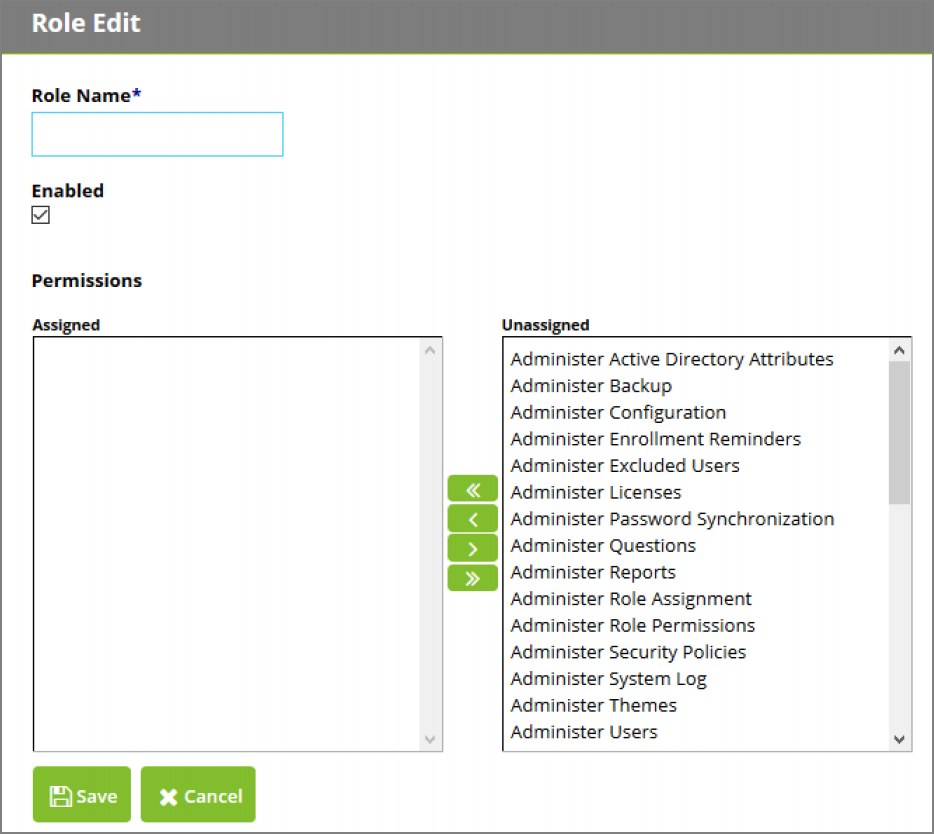
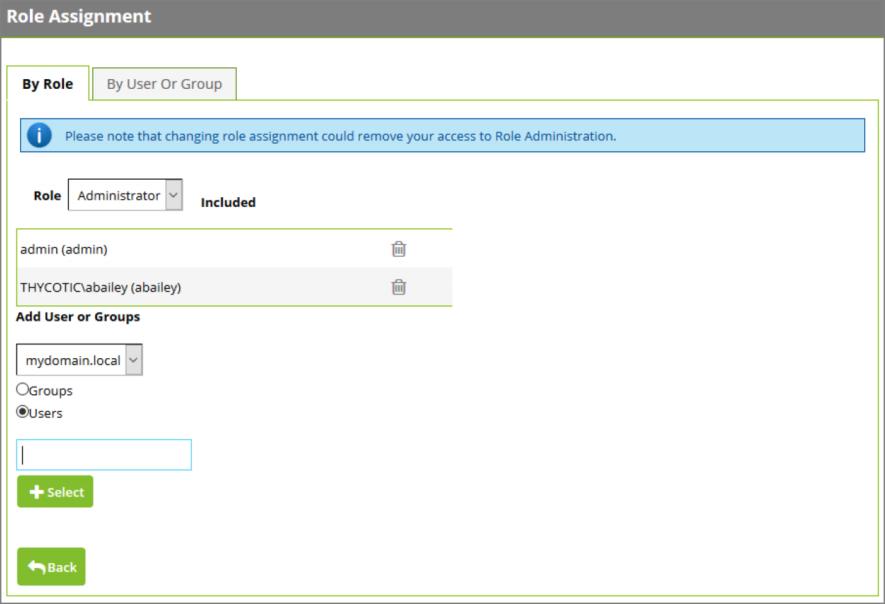
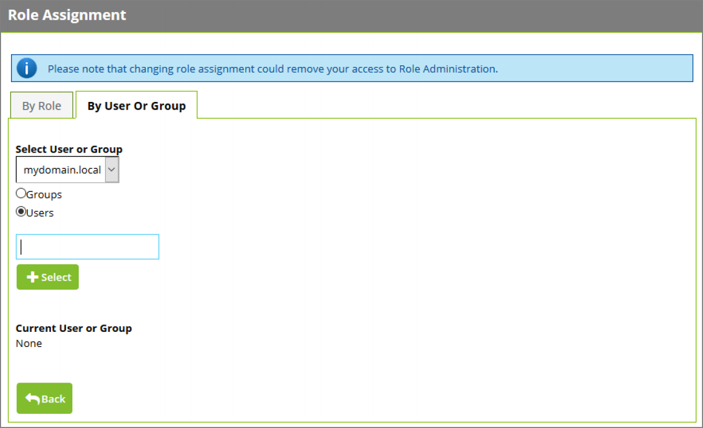
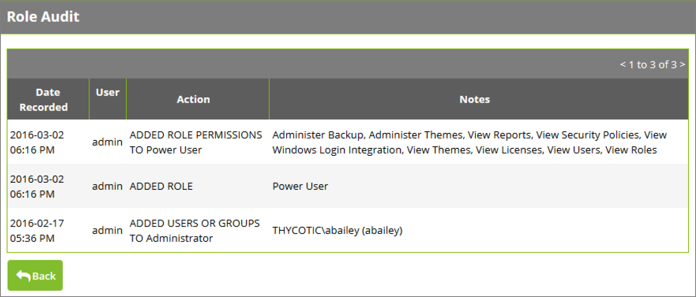

[title]: # (Access Control)
[tags]: # (access control)
[priority]: # (1)
# Access Control

Access control is Password Reset Server's method of regulating permission to system access. Each user and group must be assigned to a role. Password Reset Server ships with two roles: __Administrator__ and __User__. Each role contains various permissions to match the job function of the user. With access control, strict granular access to Password Reset Server is ensured.

## Default Roles

Password Reset Server comes pre-configured with two roles. These can be edited or disabled if necessary.

__Administrator__

The Administrator role comes will all permissions. The first account created is placed in this role.

__User__ 

The User role has no permissions. It is the default role. All users will be added to this role by default

## Administering Roles

To add a role, click the __Administration__ link on the top navigation bar and select __Roles__, then __Create__.

   

Give your role a name. You can then move permissions between __Assigned__ and __Unassigned__ by selecting the item and clicking the single arrow left or right, or moving all items to the left or right by clicking the double arrow. Finally, click __Save__.

__Tip__ You can move multiple users or groups at once by holding the Control Key (Ctrl) and clicking more than one in the list, the clicking the left or right arrow.

To edit a role, click the name of the role on the role overview screen. When editing a role, you can change the name, assign or un-assign permissions, or disable the role. A role cannot be deleted once created.

## Assigning Roles

To assign a role to users or groups, begin by clicking the Administration link on the top navigation bar and then clicking Roles, then the Assign Roles button.

### By Role

If you have a specific role you want to assign users and groups to, click the __By Role__ tab and select the role you would like to assign users and groups to. Modify the assigned users or groups by clicking them, then the left or right arrows. Click __Save Changes__ when you are complete.

   

### By User or Group
 If you have a specific user or group you would like to assign roles to, click the __By User or Group tab__ and select the user or group you would like to assign users and groups to. Modify the assigned roles by clicking them, then the left or right arrows. Click __Save Changes__ when you are complete.

   

## Role Auditing

All actions taken on roles are fully audited. This includes assigning a user or group to a role, renaming a role, disabling a role, etc. This helps ensure your company is meeting any auditing requirements imposed by industry or other standards.

__Role Audits__ 

To view changes to a role, such as renaming it, modifying its permissions, or assigning users to it, begin by clicking the __Administration__ link on the top navigation bar and then clicking __Roles__, then the __View Audit__ button. Action describes what was done and the __Notes__ describe the details of the action.

   