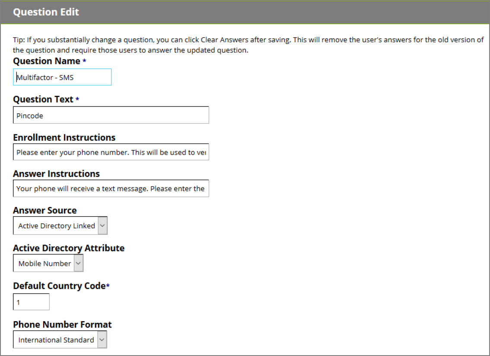

[title]: # (Attribute Answer Source)
[tags]: # (attributes)
[priority]: # (4)
# Attribute Answer Source

Active Directory attributes that are synchronized with Password Reset Server can be used as answers for text-based and multifactor questions.

__Specify an Attribute__ 

To assign an attribute as an answer to a question, navigate to __Administration > Security Questions__ and
create a new question or click a question to modify it. Click the
drop-down menu for __Answer Source__ and select __Active Directory Linked__. Another drop-down menu will then appear – select the Active Directory attribute you would like to reference for the answer. Click __Save__.

__Multifactor Phone and SMS Questions__ 

In the case of multifactor Phone or SMS questions, several additional configuration options will also
appear. Enter the country code for the phone number – this will only be used if it is not included in the
attribute value.

If the phone number is in an International Standard format, choose this option for the __Phone Number Format__ setting. Otherwise, you will need to select the __Custom__ option and specify the __Regex__ to be used to read the number from the attribute. 