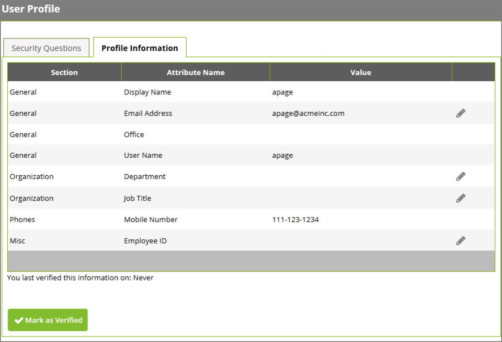

[title]: # (Configure Attribute Settings)
[tags]: # (attributes)
[priority]: # (2)
# Configure Attribute Settings

To modify these settings, navigate to __Administration > Active Directory Attributes__. There are three
settings that can be enabled by checking the box in each of the following columns:

__Synchronize__

Synchronize an attribute from Active Directory. This value will be stored in the database after the next
Active Directory sync.

__Allow User View__ 

Allow users to view the attribute value once they are logged into Password Reset Server under the __Profile Information__ tab.

__Allow User Edit__ 

Allow users to update their attribute from Password Reset Server. When users log in and go to the Profile
Information tab, they will see an “edit” icon at the end of the row for the attribute that they can click to
change the value. Once the attribute is saved here, it will be immediately updated in Active Directory.

   

If __Allow User View__ is enabled, users will be able to verify that their information is correct by clicking
__Mark as Verified__ under the __Profile Information__ tab when they log into PRS as a non-admin. This marks
an audit in the database for internal purposes (see figure on the following page).
