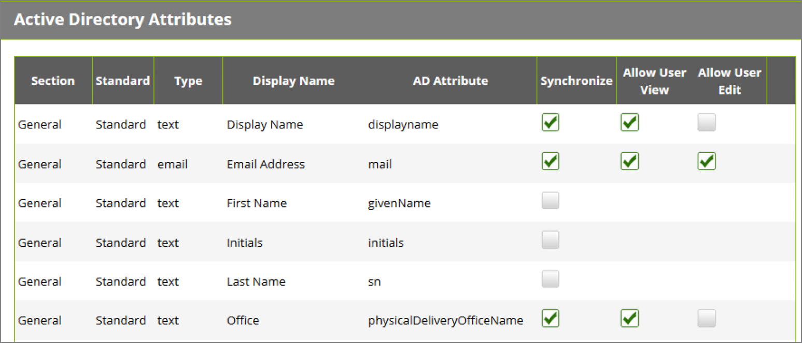

[title]: # (Active Directory Attributes)
[tags]: # (attributes)
[priority]: # (1)
# Active Directory Attributes

The Active Directory attributes settings allow Password Reset Server to synchronize additional information with Active Directory. By default, only display name and email address will be synced.

   
