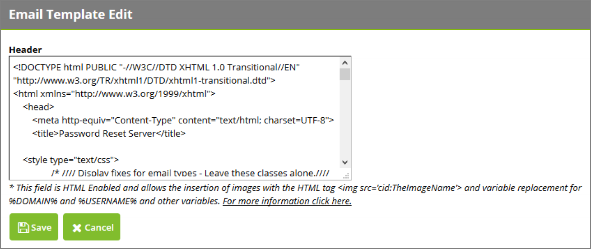
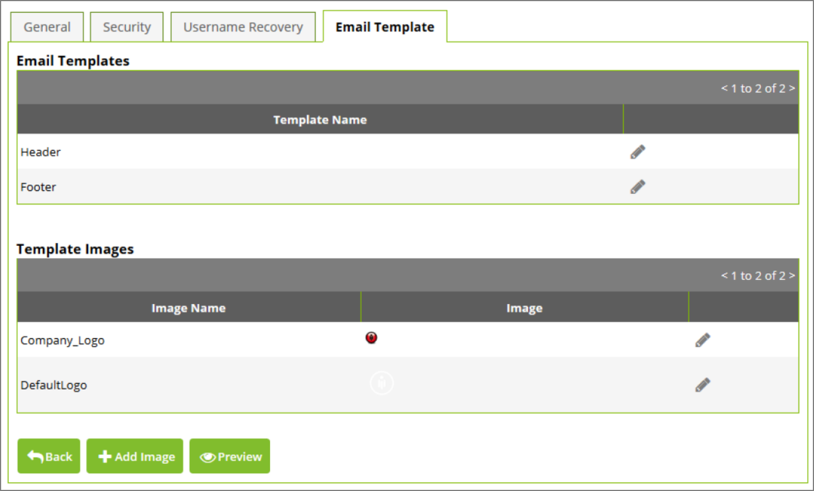

[title]: # (Email Template)
[tags]: # (configuration)
[priority]: # (8)
# Email Template

The Email Template tab under Administration > Configuration allows you to customize the header,
footer, and logo used for email notifications such as enrollment reminders.

To modify the html for the header or footer, click the “edit” icon at the end of the corresponding row in
the grid.

   
Click the “edit” icon in the Template Images grid to upload a new image from your filesystem. To add an
additional image, click Add Image.

   