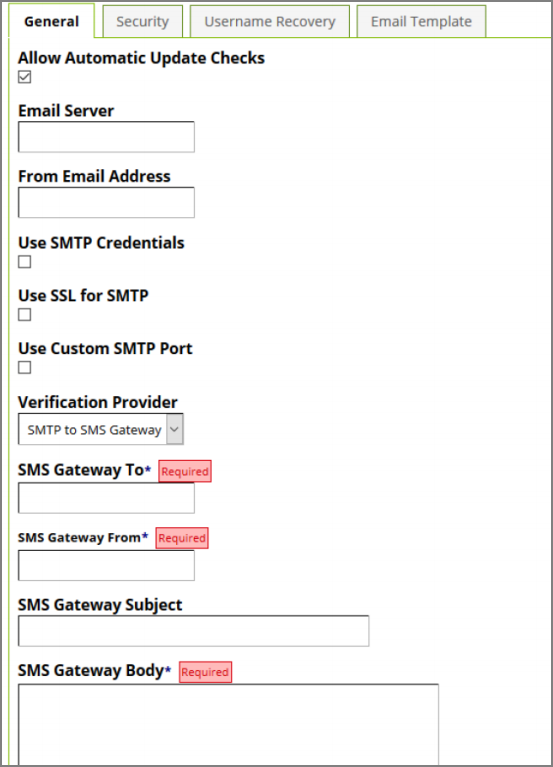

[title]: # (Configuring SMTP to SMS Gateway)
[tags]: # (configuration)
[priority]: # (8)
# Configuring Proxstop™

SMTP to SMS Gateway allows for sending SMTP to SMS messages for the purpose of multifactor
verification.

   