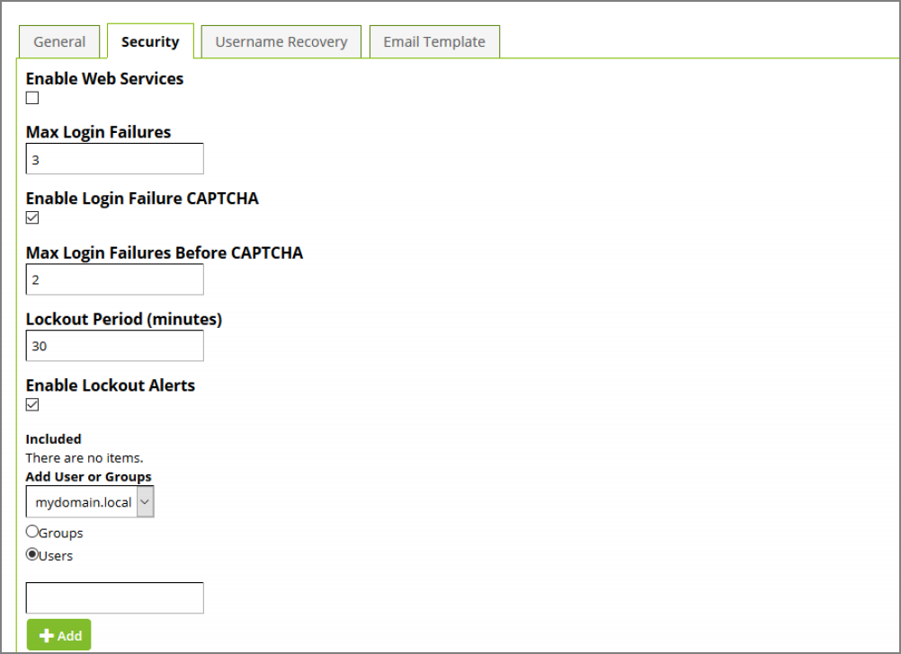

[title]: # (Security Configuration)
[tags]: # (configuration)
[priority]: # (4)
# Security Configuration

The following settings are available:

__Enable Web Services__

This will determine if web services can be used or not.

__Max Login Failures__

After providing an incorrect password this many times, the user’s account will be locked out in Password Reset Server and they must then either reset their password or wait for the Lockout Period (listed below) to pass before they can attempt to log in again.

   

__Enable Login Failure CAPTCHA__
When enabled, users will have to complete a CAPTCHA challenge in addition to providing the correct password when logging in after providing an incorrect password a certain number of times specified below. For added security, if this setting is enabled and there are 5 login failures from the same IP address in a one hour period, Password Reset Server will always require a CAPTCHA when the user attempts to log in.

__Max Login Failures Before CAPTCHA__
When Enable Login Failure CAPTCHA is enabled, this setting specifies how many times a user can provide the incorrect password before a CAPTCHA must be completed on subsequent login attempts. This amount must be lower than Max Login Failures.

__Lockout Period (minutes)__

This is the number of minutes a user must wait to log in if their account has been locked out as a result of exceeding the Max Login Failures value. This number must be an interval of 15.

__Enable Lockout Alerts__
If enabled, specified users and groups will receive an email whenever a user’s account is locked out of Password Reset Server.
