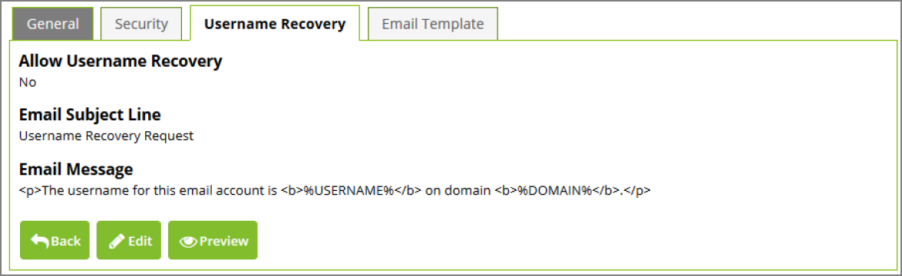

[title]: # (Username Recovery Configuration)
[tags]: # (configuration)
[priority]: # (5)
# Username Recovery Configuration

The following settings are available:

__Allow Username Recovery__

When this setting is on, there will be a link on the reset password page that takes users to a page where they can enter their email address and recover their username by email.

__Email Subject Line__

The subject line of the email that is sent to users for username recovery.

__Email Message__

The message that will be sent to users for email recovery. The message body can contain html and macro variables %USERNAME%, and %DOMAIN% which will be replaced with the actual values for the user.

   
