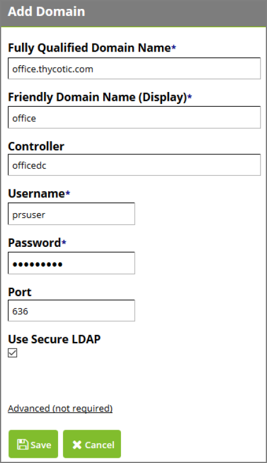

[title]: # (Adding Domains)
[tags]: # (domains)
[priority]: # (3)
# Adding Domains

To add a domain, click __Add__ from the domain management page.

   

Enter the __Fully Qualified Domain Name__ (FQDN) along with the username and password of the domain
user. If there is a domain controller you’d like to use, specify it in the __Controller__ field. To use Secure
LDAP, select the __Use Secure LDAP__ check box. If using a non-standard port, change the port. Normally the
port is 389 for LDAP or 636 for LDAPS.

Under __Advanced (not required)__, you can choose which LDAP layer you’d like to use – Pure or Negotiated.
You may choose to specify a search base DN if you don’t want to use the default one (the entire domain). Finish by clicking __Save__.

## Editing Domains 

To edit or deactivate a domain, click the domain name in the domain overview and make the desired edits, and click __Save__.