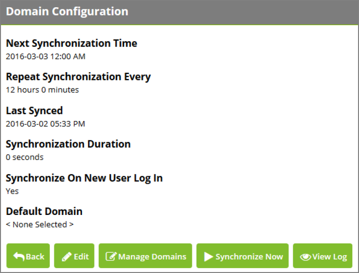

[title]: # (Administering Domains)
[tags]: # (domains)
[priority]: # (2)
# Administering Domains

To administer domains, click __Administration__ on the top navigation bar, then click __Domain Configuration__.

   
The __Next Synchronization Time__ can be set manually to choose when Password Reset Server will
synchronize with Active Directory. The __Repeat Synchronization Every__ setting determines how long
Password Reset Server will wait after the next synchronization is complete before starting another sync. Last Synced indicates the last time Password Reset Server finished synchronizing with Active Directory. Synchronization Duration shows the time it took to complete the last synchronization to give an idea of how long the next synchronization might take.

__Synchronize on New User Login__ 

__Synchronize on New User Log In__ will cause Password Reset Server to automatically synchronize if a user
logs in who has been added to Active Directory since the last synchronization. This setting is enabled by
default. With this option enabled, when a new user tries to log in they will receive a message to wait
while synchronization is occurring. After synchronization is complete, they will be taken back to the login page and prompted to log in again.

If this option is disabled Password Reset Server will then only sync when you kick off a sync manually or
when it is scheduled. With this option disabled, when a new user attempts to log in they will receive a
message like the following:

_"The system will need to synchronize this user before logging in. Please try again after the next domain
synchronization at 2015-07-08 01:00 AM."_

This configuration option replaces what was previously the __PreventSyncForNewUser__ key that could be
added to the web-appSettings.config file. If you have already added this setting, it will take priority and
the option on the __Domain Configuration__ page will be disabled. Remove this setting from webappSettings.config to control it from the __Domain Configuration__ page.

__Default Domain__ 

__Default Domain__ allows you to specify which domain will appear on the Login, Change Password, and
Reset Password pages by default the first time a user accesses any of these pages.