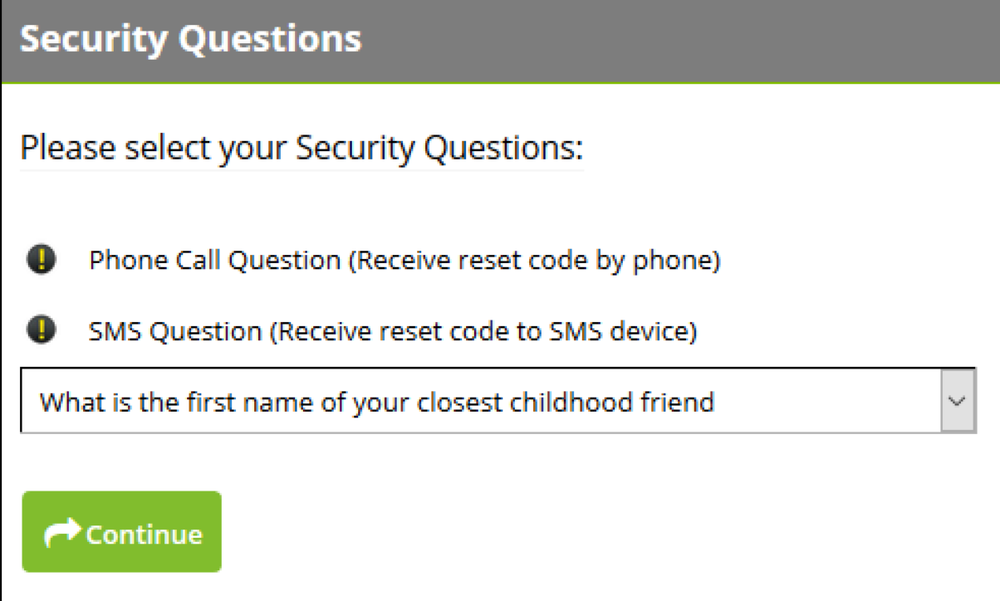
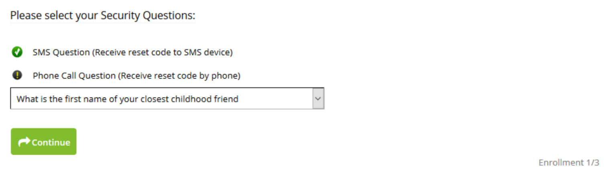
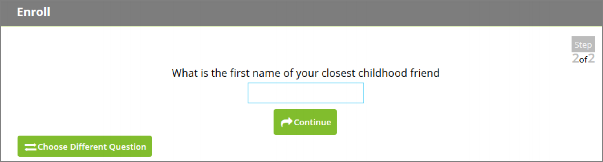
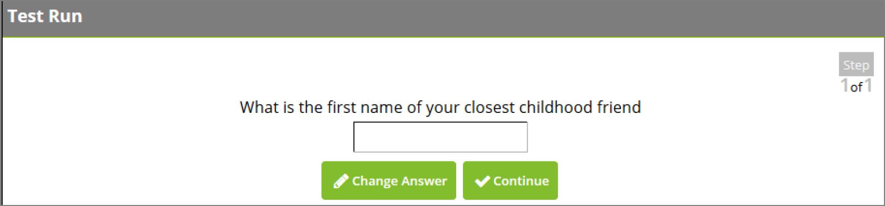

[title]: # (Enrolling)
[tags]: # (enrollment)
[priority]: # (2)
# Enrolling

A user can begin the enrollment process by opening Password Reset Server and entering their Active Directory username, selecting their domain, and entering their current password.

When a user clicks __Enroll__, they will first be asked to select be the questions they would like to answer from their security policy.

   
Questions using Active Directory attributes will display a icon next to the question title to indicate that the answer to the question is synced from Active Directory. The user will not be asked to answer
the question during enrollment, however they will be required to answer it during a test run.

   
After choosing their security questions, the user will be asked each question in turn. To modify their selection of questions during the enrollment process, a user can click Choose Different Question.

   
If a test run is required by the security policy, the user will next be required to answer all of their security questions a second time.

   
Once their enrollment is complete, the user is directed to their home screen.