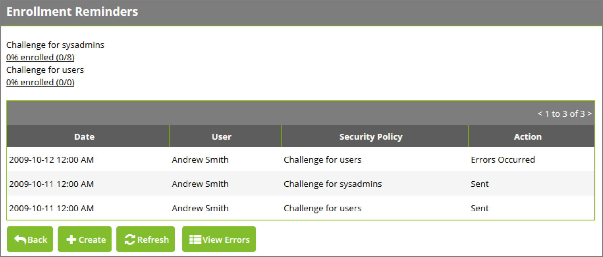
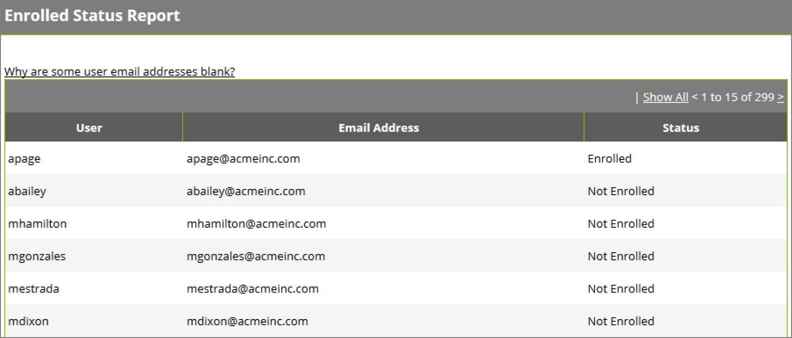
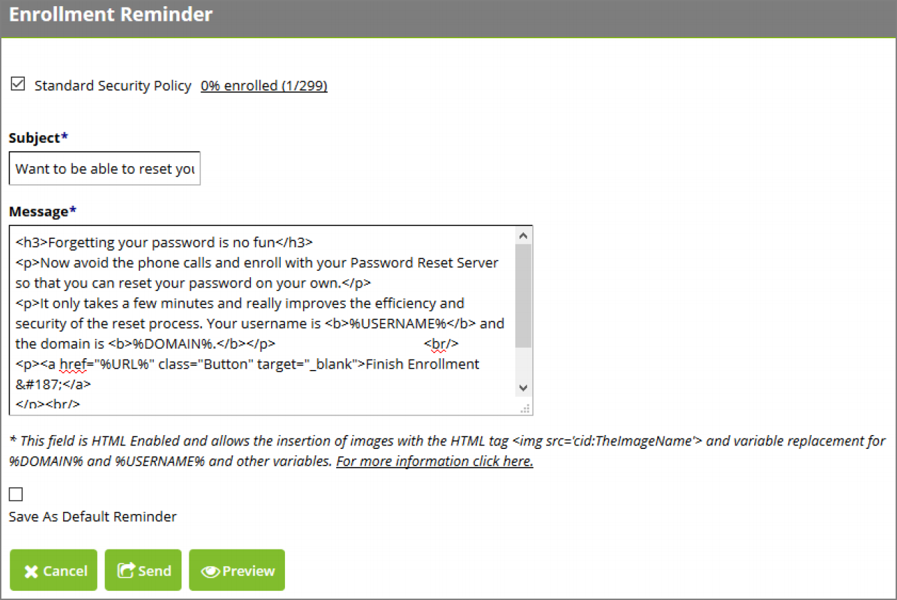

[title]: # (Enrollment Reminders)
[tags]: # (enrollment)
[priority]: # (4)
# Enrollment Reminders

Password Reset Server can send reminders to your users for enrolling and also see a percentage of how many users have enrolled in a particular security policy.

To view the enrollment reminders, click __Administration__ in the top navigation bar then __Enrollment Reminders__. The grid shows previous reminders sent out and if there were any errors.

   
Click __View Errors__ to view the errors that have occurred while sending out the reminders. Click Refresh to __refresh__ the grid.

   
The top shows each security policy and how many of them have enrolled. Click the name of the security policy for additional information regarding enrollment. This allows you to see which users have or have not enrolled in that particular security policy.

## Creating a New Reminder

To create a new reminder, click __Create__ on the __Enrollment Reminders__ screen.

Check the security policies you would like to send a reminder out for. You may not check a security policy if all of its users are enrolled. The following options are available:

__Subject__ 

The subject of the email that users in the security policies will receive.

__Message__ 

The body of the email that users in the security policies will receive. You can place the text __%LINK%__ anywhere in the message. Password Reset Server will replace it with a link that users may click to start the enrollment process.

__Save as Default Reminder__ 

If checked, clicking Send will cause your current Subject and Message to become the defaults when creating new reminders.

   
