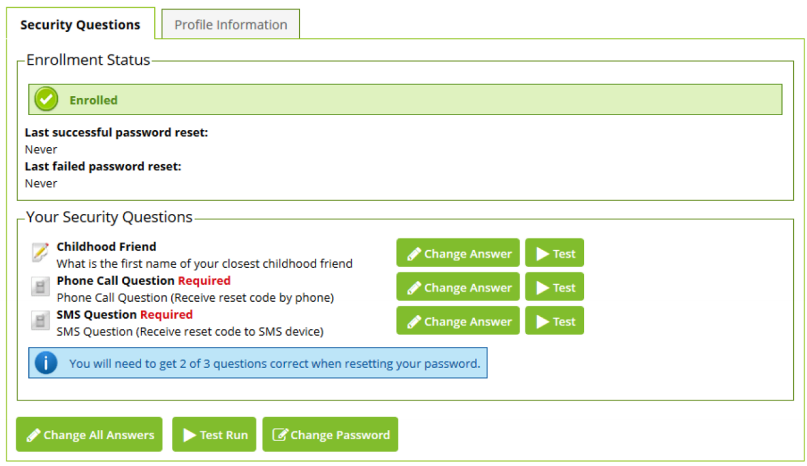

[title]: # (User Home Screen)
[tags]: # (enrollment)
[priority]: # (3)
# User Home Screen

A user can return to this screen at any time by opening a browser and clicking __Enroll__ to log into Password Reset Server with their current credentials. They can then change an answer by clicking __Change Answer__ next to a question. They can also test a single question by using the __Test__ button, and test all questions by clicking Test Run. The note at the bottom tells them how many questions they need to answer correctly when confirming their identity.

   