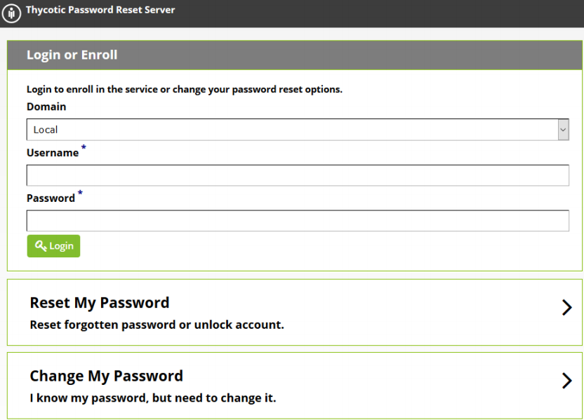

[title]: # (Getting Started)
[tags]: # (Overview)
[priority]: # (1)
# Getting Started

## PRODUCT OVERVIEW

Password Reset Server is a web-based application that allows users in your Microsoft Active Directory
Domains to reset their password without the help of an administrator. The administrator chooses which
users and Organizational Units are allowed to reset their passwords. These users then enroll in a list of
questions that the administrator chooses. When a user attempts to reset their password, they are
prompted to answer all of their questions to verify their identity. Once the identity has been confirmed,
Password Reset Server will reset and unlock the user’s account.

## INSTALLATION

Password Reset Server is distributed as an MSI or as a ZIP file of the web application. To install Password
Reset Server and the software it depends on (such as SQL Server and Internet Information Services)
please see our [Installation Guide](../installation/index.md).

## ACCESSING PASSWORD RESET SERVER

Password Reset Server presents three options to users on the main page: Login or Enroll, Reset My
Password, and Change My Password.

   

Clicking __Login__ will allow users to log into the system. If they have not yet enrolled, they will be required
to complete the enrollment process. Otherwise, they will be presented with a screen displaying
information on their security questions. See User __Home Screen__ for details. Administrators will be
presented with the administration dashboard.

Users can log in with their AD username or their UPN. Additionally email logins can be set up in
__Administration | Configuration__.

## TERMINOLOGY

These terms are used to refer to specific features or concepts within Password Reset Server:

__Administrator__:

Password Reset Server does not have a true administrator or administrative user, however within this
guide an administrator refers to the user(s) who manage the system. Administrators have control over
the global security and configuration settings.

__Access Control (RBAC):__

Password Reset Server uses role-based access to determine which users and groups have access to
specific features within the application. Access control allows fine and granular permission for each user.
For more information, see the section on __Access Control__.

__Enrollment:__

Enrollment is when a domain user has successfully answered all of the questions for their security policy.
Once a user has been enrolled, they are allowed to reset their password when they confirm their identity
by successfully answering their questions. For more information, see the section on __Enrollment__.

__Questions:__

Questions are answered by a user and must be answered to complete enrollment. For a user to enroll,
they must answer each question that is part of their security policy which will confirm their identity to
Password Reset Server. When the identity has been confirmed, the user is then prompted for their new
password. For more information, please see the section on __Questions__.

__Security Policies:__

A security policy defines which questions a user or group of users must enroll in and will have to answer
when they attempt to reset their password. For more information, please see the section on Security
__Policies__.
