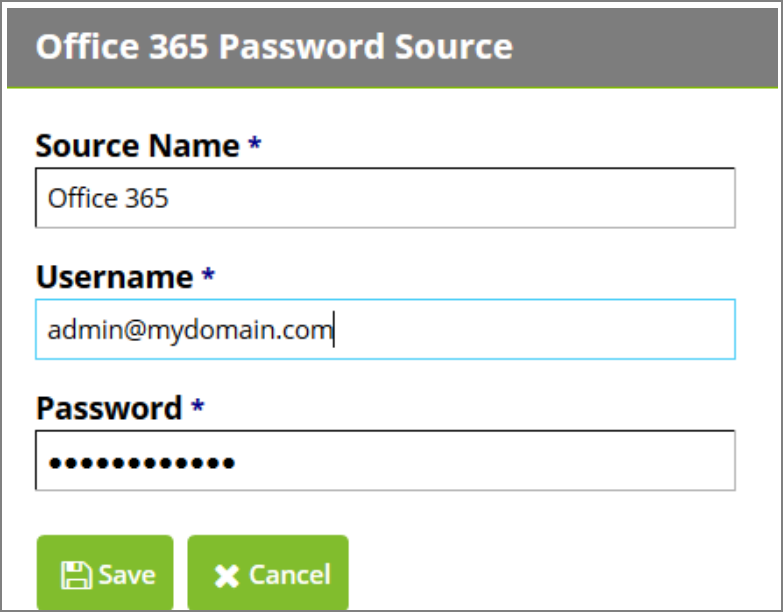

[title]: # (Password Sources)
[tags]: # (sources)
[priority]: # (1)
# Password Sources

## Creating a New Password Source

You can use password sources to define additional Office 365 domains that will be used to change an
additional password for a user when a password change or password reset is performed.

By default, password sources will always contain an Active Directory password source once you define a
domain in PRS. To add a new password source, click __Add__ and then select your __Source Type__ (currently
either Active Directory Domain or Office 365).

If you choose __Active Directory Domain__, you will prompted to add domain information (see __Domain
Configuration__). If you choose Office 365 Domain you will need to complete the following form:

   

__Source Name:__

The display name of the source.

__Username:__

The Office 365 administrator user that will be used to change the end user’s password during the reset
process. This user must be an Office 365 administrator

__Password:__

The password of the Office 365 administrator.
