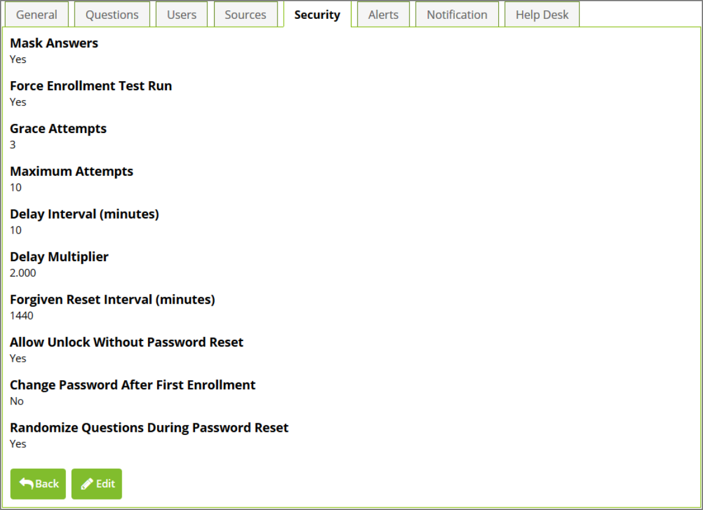

[title]: # (Configuring Security)
[tags]: # (security)
[priority]: # (4)
# Configuring Security

To view or edit the security settings of a security policy, click the __Security__ tab at the top of the policy
overview. To edit these values, click the __Edit button__. From the Editscreen you can click __Save__ to save your
changes or __Cancel__ to abort them.

   

__Mask Answers__

When a user is enrolling in the questions for this security policy, all of the answers that they type will be
masked instead of showing the real characters entered.

__Force Enrollment Test Run__

When a user completes the enrollment process for this security policy, they will be forced to do a dry
test-run of the reset process without actually resetting their password. This ensures that the user is
comfortable with answering the questions.

__Grace Attempts__

The number of successive failures a user can have when resetting their password before they are forced
to wait before making another attempt. Forcing a user to wait between tries after they fail the number
of grace attempts is to ensure a malicious person does not try to brute-force the reset by guessing
common answers to questions.

__Maximum Attempts__

The maximum number of failures a user can have before they must wait for the __Forgiven Reset Interval__ to pass.

__Delay Interval__

The time, in minutes, a user must wait before they are allowed to try again after they use all of their
grace attempts. For example, given three grace attempts, the user will be forced to wait this many
minutes before they are allowed to try a fourth time.

__Delay Multiplier__
The factor for which to increase the __Delay Interval__ between each successive failure the user makes. Set
the __Delay Multiplier__ to 1 if you do not wish to use this feature.

__Forgiven Reset Interval__

The amount of time, in minutes, must occur for the number of failures to decrease.

## Configuring the reset attempt:

The __Grace Attempts, Maximum Attempts, Delay Interval, Delay Multiplier__, and __Forgiven Reset Interval__ fields control how many times a user can try to reset their password and what happens when their reset attempts fail.

The following process occurs when a user attempts to reset their password based on the values of these fields:

1. The user is prompted for their account name.
1. PRS checks if there are any reset attempt failures since the last successful reset. If there are and
the number of failed attempts is less than the number of Grace Attempts defined in the Security
Policy (or Grace Attempts is zero) the user is allowed to proceed. (See below for the process if
the number of failed attempts is not less than the number of Grace Attempts). The current release allows the user to try one more time than the Grace Attempts. So, if the
Grace Attempts is set to three, the user can actually attempt a password reset four times before
the procedure below kicks in. This will be fixed in the next release.
1. If validated, the user is prompted for their security question or questions.
1. If the answers meet the minimum requirements defined in the Security Policy, the user is allowed
to reset their password. Otherwise, the user receives a message that their identity could not be verified and that they can try again.

If the number of failed attempts is not less than the number of Grace Attempts AND Grace Attempts is
not zero, then:

1. The user will be informed that they have exceeded the number of retries and that they must wait until a time calculated as number of minutes specified by the Delay Interval defined in the Security Policy past the last failed retry.
1. After the Delay Interval has passed the user can attempt to reset their password again. If they
fail to answer the security questions again they will need to wait until a time calculated as the
Delay Interval x Delay Multiplier past the last failed retry before attempting to log in again.
1. Each subsequent retry failure will increase the time before they can try again by the Delay
Multiplier (see example, below).
1. If the user attempts to reset their password more than the Maximum Attempts defined in the Security Policy they will be blocked from trying to reset their password until the number of
minutes defined in the Forgiven Reset Interval has passed. After that interval has passed, the system resets and the user gets the Grace Attempts number of retries again before the Delay Interval and Multiplier are applied.

__Example__ 
If the following settings are configured in the security policy:

* Grace Attempts: 3
* Delay Interval: 10
* Delay Multiplier: 2
* Maximum Attempts: 6
* Forgiven Reset Interval: 1,440

When a user attempts to reset their password but does not know their security answers, the following
will happen:

1. The user will be given three tries to answer their security question or questions.
1. The fourth time the attempt to reset their password they will be informed that they must wait 10 minutes from the time of their third failed attempt before trying again. So, if their third
attempt occurred at 2:30 PM and they are trying for the fourth time at 2:34 PM they must wait six more minutes.
1. If they retry again at 2:45 PM and fail again, they will not be allowed to try again until 3:05 PM (2:45 PM plus 10x2 minutes).
1. If they try a fifth time at 3:15 PM and fail again they will not be allowed to try again until 3:55 PM (3:15 PM plus 10x2x2 minutes).
1. If they try a sixth time at 4:00 PM and fail again they will have tried the maximum allowed number of times. They will not be allowed to try resetting their password until 4:00 PM the following day
(the Forgiven Reset Interval of 1440 minutes = 1 day).
1. After 4:00 PM the following day they will be able to try resetting their password again. All previous failures are forgiven so they will have three grace attempts again. Then the process
described above will repeat.

>**Note:** : If __Grace Attempts__ is set to zero all delaying strategies are disabled, including the __Maximum Attempts__ and __Forgiven Reset Interval__. Setting __Grace Attempts__ to zero is not advised since it allows a malicious person an unlimited number of attempts to gain access to a user's account by brute-force
guessing common answers to questions.

__Allow Unlock Without Password Reset__ 

If this flag is set to ‘Yes’, after users prove their identity they can decide to unlock their account instead
of resetting the password.

__Randomize Questions During Password Reset__ 

If ‘Yes’, questions will be presented to the user in random order during a password reset and enrollment.