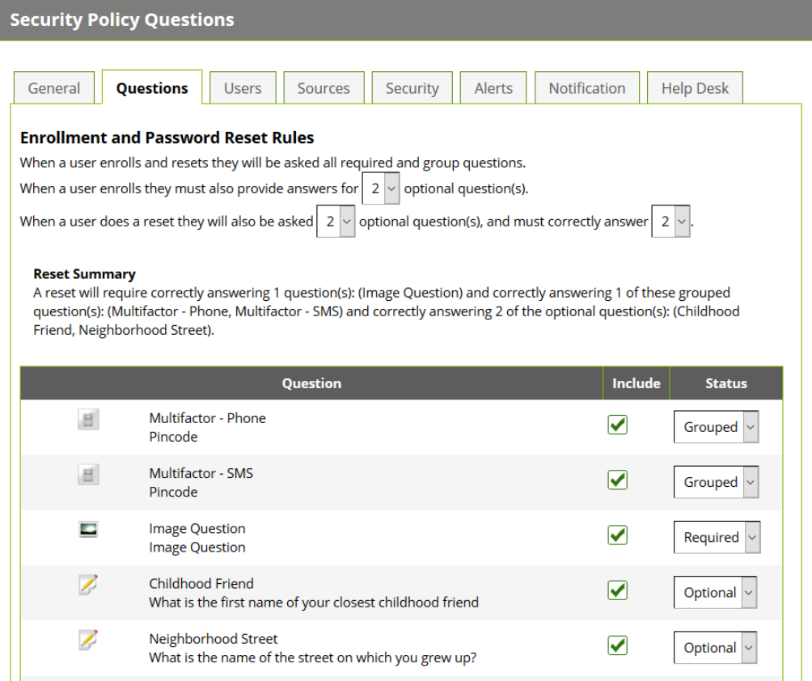

[title]: # (Configuring Questions)
[tags]: # (questions)
[priority]: # (5)
# Configuring Questions

To view the assigned questions or modify them, click __Questions__ at the top of the security policy overview.

To modify which questions belong to the policy, click __Edit__. You can then select or deselect the __Include__
check box for each question to add or remove it from the policy. Select the question status from the
Status drop-down menu. The three options are as follows:

__Optional:__

The question will be available, but not required, to answer during enrollment, a reset, and when the user
updates the answers to their questions.

__Required:__

The question will be required to answer during enrollment and during a reset.

__Grouped:__
The question will be required to answer during enrollment. Upon a reset, the user will be required to
answer one of the grouped questions correctly.

   

To give your users flexibility, you can set how many questions must be answered for enrollment and
password reset using the drop-down menus at the top of the window. For example, in the image above,
users must enroll in three questions (First Car, Childhood Friend, and Employee Phone Number). When
answering these questions to reset their passwords, they must answer two of the three questions they
enrolled in correctly.

View the __Reset Summary__ for an overview of the questions and settings you’ve chosen. Once you have
your desired questions, click __Save__, or __Cancel__ to abandon your changes.
