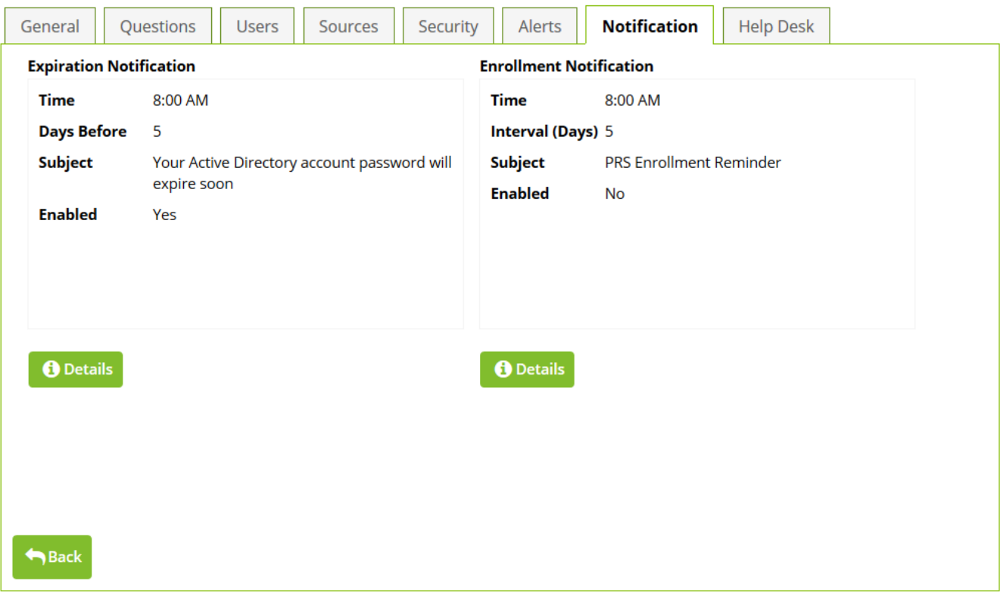

[title]: # (Configuring Expiration Notifications)
[tags]: # (notifications)
[priority]: # (6)
# Configuring Expiration Notifications

To view or edit the Expiration Notification or Enrollment Notification settings of a security policy, click the __Notification__ tab at the top of the policy overview.

   
Clicking the __Details__ button under either will take you to the main configuration page for the selectednotification type.

When the current __Expiration__ Notification is enabled, members of this security policy will receive an email
before their AD account’s password expires. To adjust the time the email is sent, change the __Time__ setting. To set how many days before the expiration the email should be sent, change the __Days Before__ setting.

>**Note:** No email will be sent on the actual day of expiration. If the __Use Default Notification__ setting is true, the standard email will be sent. To change the subject and body of the email, set __Use Default Notification__ to false and change the __Subject__ and __Message__ values.

When the current __Enrollment__ Notification is enabled, members of this security policy will receive an email if they are not yet enrolled in Password Reset Server. To adjust the time the email is sent, change the __Time setting__. To set how many days should pass in between Enrollment Reminders before the next
one is sent, change the __Interval (Days)__ setting.

