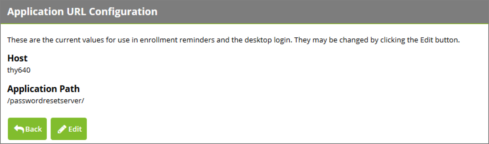

[title]: # (Configuring the Host Name)
[tags]: # (intergration)
[priority]: # (3)
# Configuring the Host Name

During Password Reset Server’s installation, a host name is chosen that will be used when Windows Login Integration clients connect to the server. To change the host name, first click on __Administration__, then click the __Windows Login Integration__ button, and finally click the “here” link at the end of the
message. This will take you to the following page, where you can change the host name.

   
