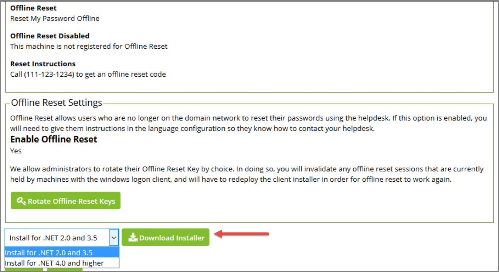

[title]: # (Deployment)
[tags]: # (intergration)
[priority]: # (2)
# Deployment

The recommended method of deployment is via MSI. To download the MSI, click Administration and then Windows Login Integration. At this point the MSI may be downloaded via the Download Installer
button. Select the .NET framework that applies to the version of the Windows operating system you are running in your environment before clicking Download Installer.

   