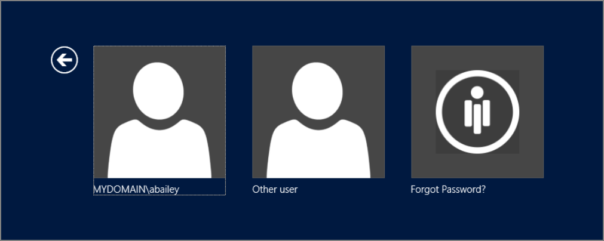

[title]: # (Windows Login Intergration)
[tags]: # (questions)
[priority]: # (1)
# Windows Login Intergration

Password Reset Server allows integrating into the logon screen of the Windows Operating System. This
allows enrolled users to reset their password directly from the logon screen by clicking Forgot Password?
The desktop logon application will work on the Windows XP operating system or higher.
This functionality utilizes the Credential Provider infrastructure that is built into Windows. It is installed
by copying the dynamic link library to the machine and modifying the registry. For technical information,
please refer to the appendix.
The Windows Login Integration is required for a user to be able to perform an offline reset on their
machine.

   