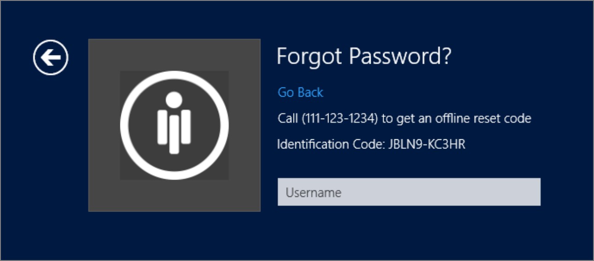
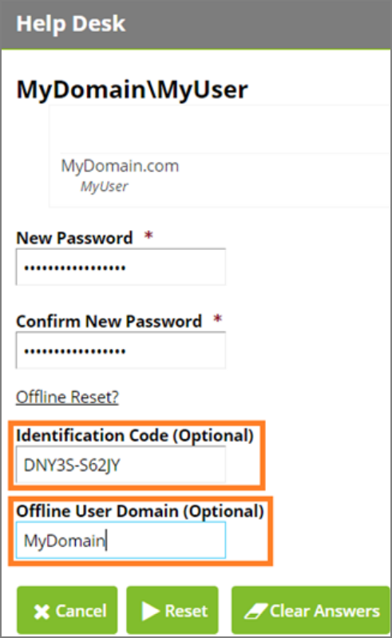
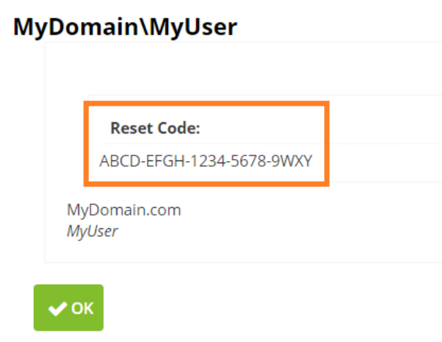
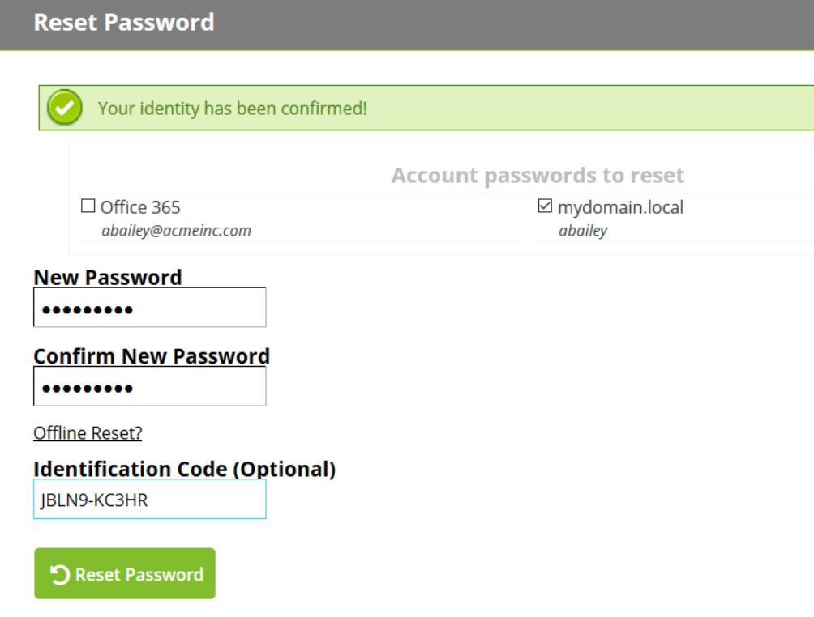
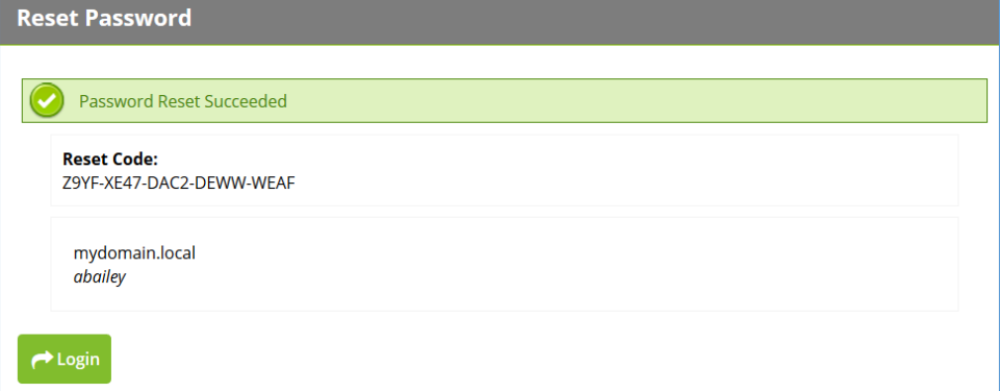
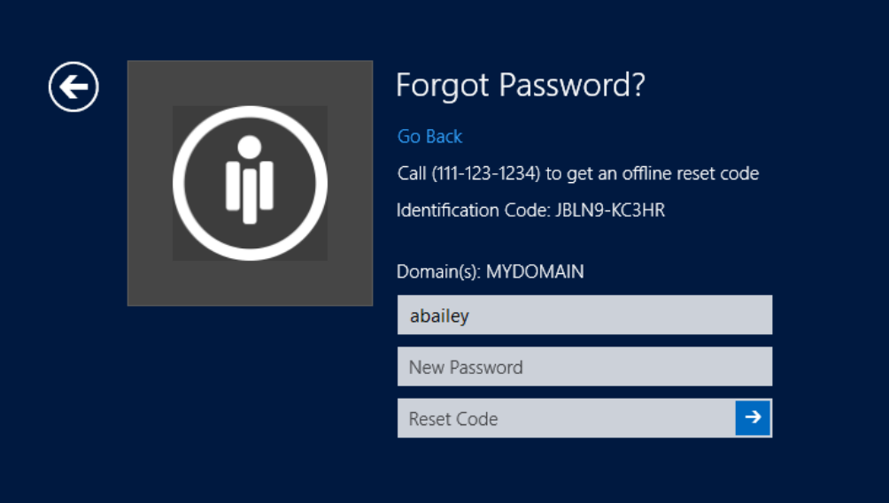

[title]: # (Offline Reset)
[tags]: # (intergration)
[priority]: # (4)
# Offline Reset

An offline reset works by the end user starting the reset process through the Windows Login Integration
UI and getting an identification code. This identification code will be entered during a normal password
reset on Password Reset Server, either through a self-reset or via a helpdesk reset. When the reset is finished, a Reset Code will be displayed, and the user will use this, along with their new password, to reset their password on the Windows machine.

   
The Identification Code is unique per machine. Each machine will get a unique encryption key that will
be used to retrieve the password from the reset code generated by the server. If these keys need to be
regenerated click the __Rotate Offline Reset Keys__ which will invalidate and recreate the keys. This will require the Windows Login Integration redeployment for the offline reset to work again.

## Help Desk Offline Reset

A help desk user will reset the end users password as normal. But the end user will need to provide the
Identification Code. The Offline User Domain needs to match the user’s domain on the Windows machine. If left blank it will default to the first part of the FQDN.

   
After resetting the users password the help desk user will be given a reset code to give to the end user.

   

## Self Service Offline Reset

The end user can perform a self-service password reset as normal through the web browser. This requires Password Reset Server to be publicly accessible so the end user can reset using their phone or another internet connected device.

At the end of the reset process the user will have to provide their Identification Code.

   

   

After the user resets their password they will need to enter their reset code, username, and their new password into the windows login integration.

   
The user will be able to login as normal with their new password.