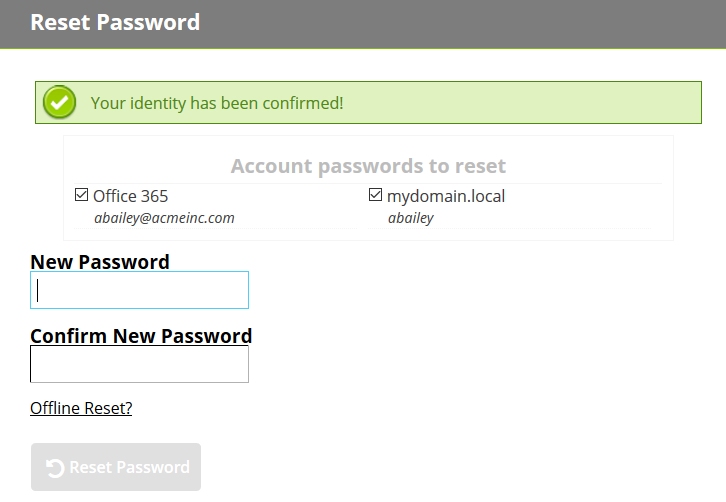
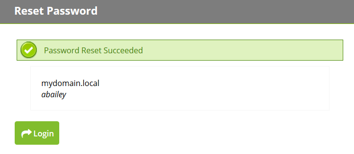

[title]: # (Confirmation)
[tags]: # (reset, password)
[priority]: # (3)

# Confirmation

After you have successfully answered your security questions, you will be prompted to create a new password. If your administrator has allowed the option, you will also be able to unlock your account without resetting your password. If your account has been configured to allow reset of password in multiple systems, you can select the systems on which you would like to reset your password.

Once your password has been changed, close the window by clicking the **X** button in the top-right corner of the window.

Log in to your account using the new password you created.
