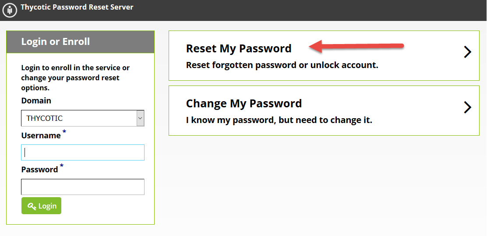

[title]: # (Getting Started)
[tags]: # (reset, password)
[priority]: # (1)

# Getting Started

To begin you can click on the **Forgot Password** button on the windows login screen.

You can also reset your password through the web interface by going to the Password Reset Server URL (\*see system administrator) and clicking the **Reset Password** button. You may receive reminder emails when your password is going to expire.

