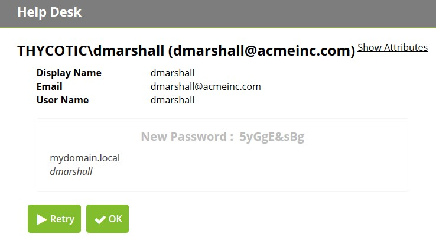

[title]: # (Using Help Desk)
[tags]: # (help desk)
[priority]: # (401)

# Using Help Desk

First, log into Password Reset Server with your Active Directory credentials by clicking **Enroll** from the main Password Reset Server page. Search for a user by typing in the **Find User** search field. You can search by a user’s display name or email address. Select a user from the results and you will be taken to the page where you can select which password sources you wish to change.

Click **Reset** to reset the user’s password. Click **Clear Answers** to make the user re-enroll. Click **Cancel** to return to the previous page. Any synced Active Directory attributes will be displayed for a user to act as an identity verification after clicking **Show Attributes**.

**Note:** If you would like additional attributes to be displayed, please contact your Password Reset Server administrator.

When attempting to reset a password through this screen, the help desk user will be prompted for a comment which will be added to Password Reset Server reports.

After a user’s password is reset by the help desk, the help desk user can read the user their new passwords. When the user next logs in, they will be forced to
change their password.

## Offline Reset 

If a user’s machine is not connected to the corporate domain they won’t be able to perform a standard reset and use the new password on the domain. In order to reset their password on their machine they need to do an offline reset.

Each machine with the Password Reset Server Windows Login Integration will have an Identification Code that will need to be provided to the help desk use. Enter this Identification Code into the Help Desk reset process to get a reset code.

The Offline Reset User Domain needs to match what the user’s domain is shown as in the Windows Login Integration.

After resetting the user’s password on the domain, give them the reset code which they can enter along with their new password.

