Password Reset Server MSI
=========================

Make sure you have the [prerequisites](#beginning-the-installation-process)
installed before attempting to setup Password Reset Server.

Download the latest version of Password Reset Server
----------------------------------------------------

The latest version of Password Reset Server is available for
[download](https://thycotic.com/products/password-reset-server/resources/download/).
After clicking the Download button, the setup.exe file will be downloaded to
your machine.

Running the MSI
---------------

When running the setup.exe file, your first option will be to choose Standard or
Advanced.

### Standard Option

This option installs Password Reset Server as a virtual directory under the
Default Website. This is recommended if you have existing sites using the
Default Website, and is also the fastest way to get up and running.

### Advanced Option

This option installs Password Reset Server as a new website without using the
Default Website. This allows you to specify a port number that the website will
run under. Using this option assumes some knowledge of IIS and is often followed
up by adding a DNS entry on the domain controller. This option must be used if
there is no Default Website already present.

### File Destination

This is the location where the application files will exist. The folder is
typically

C:\\inetpub\\wwwroot\\PasswordResetServer but can be customized to follow your
convention.

### Application Name

Application name will be used when creating the Application Pool and either the
website or the virtual directory, depending on the selected option above.

### Completing Installation from Password Reset Server 

Once the MSI completes, the website will be set up with the correct permissions.
The browser will open to allow you to complete the Password Reset Server
installation from the webpage. The following section will guide you through this
process.

Completing Password Reset Server installation from the website
==============================================================

Password Reset Server is now ready to begin installation through its installer.
Open a browser and browse to where your Password Reset Server is located, for
example:

*http://localhost/passwordresetserver*

Password Reset Server has a 5-step installation process:

1.  Step 1 ensures that the identity running the Password Reset Server
    application pool has write access to the application directory. The account
    running the IIS application pool requires modify permission (this includes
    the write permission) to the application folder to continue.

>   If you don’t want to change the permissions of a folder, you can give
>   Password Reset Server a Windows username and password that has modify
>   permissions already, and Password Reset Server will “impersonate” as that
>   user during the installation process.

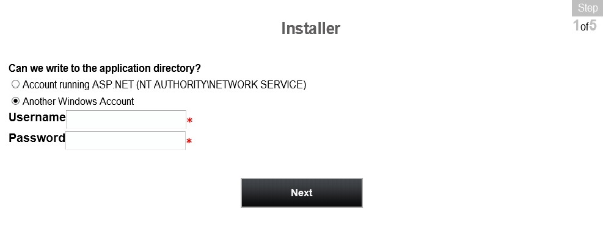

>   Password Reset Server only needs write permission during installation and
>   upgrade. You can remove the write and modify permissions once the
>   installation process is complete.

>   Once the permissions are set, click Next.

See the [Manual Installation](#manual-installation-no-msi) section for more
information on account permissions.

1.  In Step 2, specify the database. If Password Reset Server is installed on
    the same machine as SQL Server, you can type (local). If you are using a
    named instance of SQL, use a slash then the instance name, for instance:
    (local)\\InstanceName. If you are not sure of the instance name, you can
    open SQL Server Management Studio and select Connect. The full instance name
    used here is the same one that will be used by Password Reset Server, for
    example THYCO1\\SQLEXPRESS.

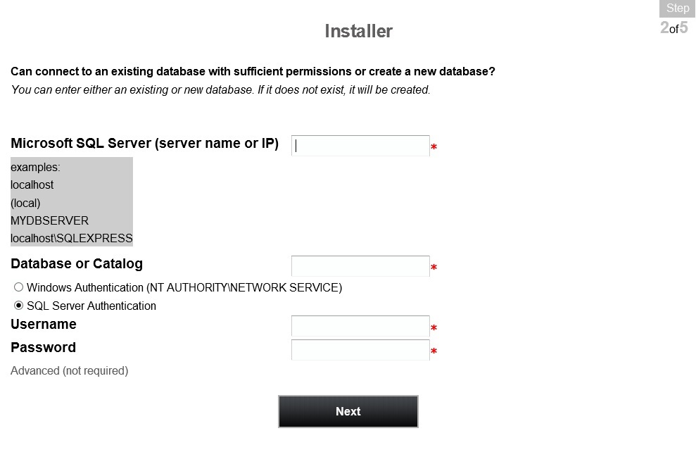

Password Reset Server will create the database for you if it does not exist.

Enter the SQL Username and Password if using SQL Server Authentication, or
select Windows Authentication. To create a SQL Server user, see [Creating the
SQL Server User](#adding-a-sql-server-user).

1.  Review the EULA and check the I Agree box, then click Continue to accept the
    agreement. Otherwise, Password Reset Server will not be installed.

2.  Password Reset Server will now ask you to create your first user. This user
    will be a local administrator that will be used to configure your Password
    Reset Server. We recommend choosing a strong password.

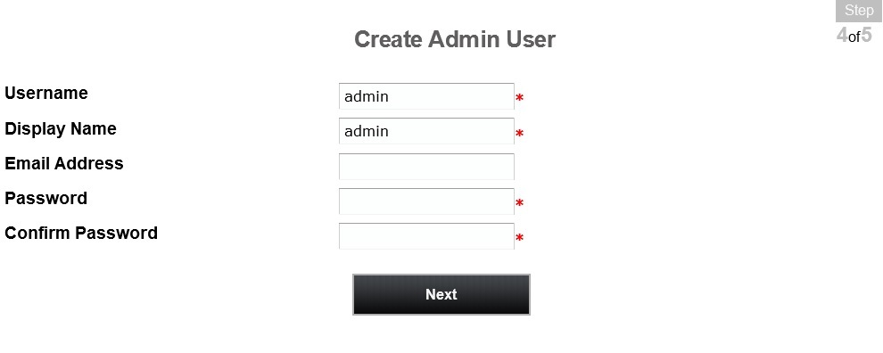

1.  Step 5 will prompt you to enter a domain and credentials for a domain
    account that has the required permissions to reset passwords on the domain.
    See [Creating a Domain Account to Reset
    Passwords](#creating-a-domain-account-to-reset-passwords).

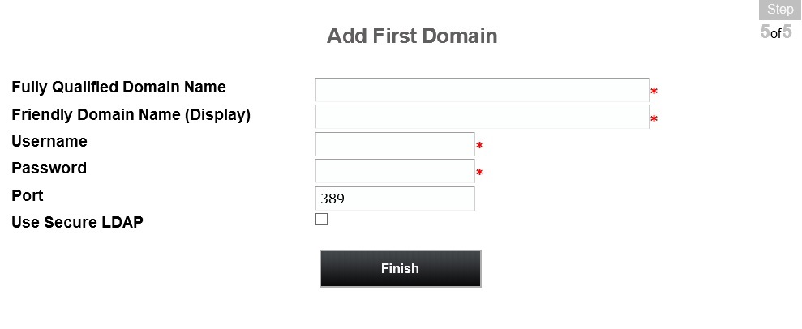

The domain name needs to be the Fully Qualified Domain Name (FQDN), for example:
use *domain.thycotic.com* instead of *domain*.

Password Reset Server has now successfully been installed. For more information
on configuring and maintaining your Password Reset Server, please see our [User
Guide](https://updates.thycotic.net/link.ashx?PRSUserGuide).

Manual Installation (No MSI)
============================

If you are knowledgeable of IIS and would prefer to manually install the website
without using the MSI, you can follow these instructions.

[Download](https://updates.thycotic.net/links.ashx?prsofflinefile) the latest
version of Password Reset Server. You can choose to download a ZIP file that
contains the Password Reset Server files. Use this ZIP file for the instructions
below.

Password Reset Server can be installed in a few different ways:

-   As a virtual directory

-   As a website

-   As part of a website

Make sure you have the [required software](#prerequisites) installed before
attempting to setup Password Reset Server.

Installing as a Virtual Directory
---------------------------------

1.  Extract the contents of the ZIP file where you would like Password Reset
    Server to be located on your system.

2.  Open the IIS Control Panel by going into the Control Panel, then
    Administrative Tools \> Internet Information Services (IIS) Manager.

3.  Highlight the Default Web Site, right-click it and select Add Virtual
    Directory (see Figure 1.1 below).

4.  Select an alias for your Password Reset Server. The alias is what will be
    appended to the website. For instance,
    *http://myserver/PasswordResetServer*.

5.  Select the physical directory for where you unzipped Password Reset Server.

6.  In the tree, right-click the virtual directory and select Convert to
    Application. Click OK.

7.  Click the Application Pools node, then highlight the application pool
    running Password Reset Server. Click Advanced Settings in the right pane.
    Under Process Model, set Identity to a Windows service account or leave the
    default ApplicationPoolIdentity (Figure 1.2).

Windows 8 / Server 2012 will default the application pool to a virtual identity,
ApplicationPoolIdentity. For easiest configuration, use either this or NETWORK
SERVICE as the identity. For better security, you can specify your own Windows
service account. See the [Appendix](#appendix) for further information on using
a virtual identity for Password Reset Server in IIS.

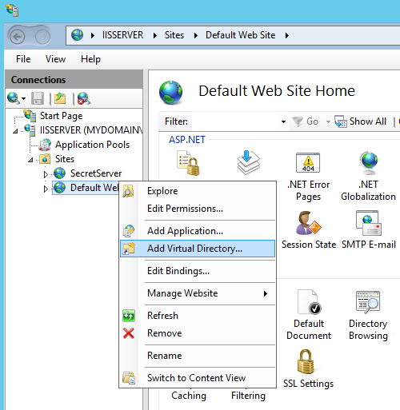

*Figure 1.1 – Add Virtual Directory*

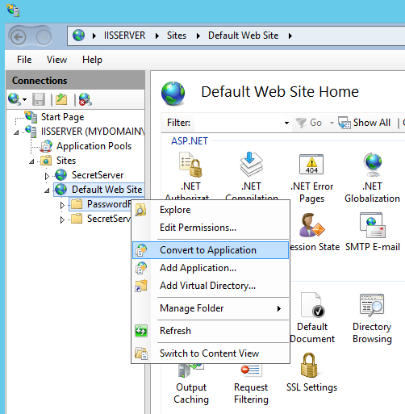

*Figure 1.2 – Convert to Application*

1.  Ensure that the Password Reset Server folder has the proper permissions by
    checking that the account running the application pool in IIS has Modify
    permissions on the folder where Password Reset Server is installed.

Password Reset Server is now ready to be installed. See [Completing Password
Reset Server
installation](#completing-password-reset-server-installation-from-the-website).

Installing as part of a Website
-------------------------------

1.  Extract the contents of the ZIP file where you would like Password Reset
    Server to be located on your system (a common location is
    C:\\inetpub\\wwwroot).

2.  Open the IIS Control Panel by going into the Control Panel, then
    Administrative Tools \> Internet Information Services (IIS) Manager.

3.  Expand the Default Website and locate the Password Reset Server folder.
    Right-click it, and select Convert to Application. Click OK.

4.  Click the Application Pools node, then highlight the application pool
    running Password Reset Server. Click Advanced Settings in the right pane.
    Under Process Model, set Identity to a Windows service account or leave the
    default ApplicationPoolIdentity (Figure 1.2, see the previous page).

Windows 8 / Server 2012 will default the application pool to a virtual identity,
ApplicationPoolIdentity. For easiest configuration, use either this or NETWORK
SERVICE as the identity. For better security, you can specify your own Windows
service account. See the [Appendix](#appendix) for further information on using
a virtual identity for Password Reset Server in IIS.

1.  Ensure that the Password Reset Server folder has the proper permissions by
    checking that the account running the application pool in IIS has Modify
    permissions on the folder where Password Reset Server is installed.

Password Reset Server is now ready to be installed. See [Completing Password
Reset Server
installation](#completing-password-reset-server-installation-from-the-website).

Configuring the Pipeline
------------------------

Password Reset Server is by default placed in the DefaultAppPool application
pool, which may not be set to use the correct pipeline for Password Reset
Server. PRS requires that the application pool’s managed pipeline mode be set to
Classic. This can be done by modifying the application pool settings or creating
a new one.

It is recommended that you create a new application pool if you have other web
applications running on the server. This will help avoid changing the
configuration for another application.

### Changing the Pipeline Mode

1.  In the Internet Information Services (IIS) Manager, select the Application
    Pools node.

2.  Double-click the DefaultAppPool.

3.  Set Managed Pipeline Mode to Classic. Click OK.

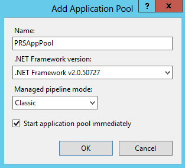

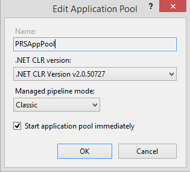

*IIS Application Pool - Windows 8 IIS Application Pool - Windows 8.1*

The Windows Server 2012 R2 and Windows 8.1 application pool window will appear
slightly different than in Windows Server 2012 and Windows 8.

### Creating a New Application Pool

1.  In the Internet Information Services (IIS) Manager, right-click the
    Application Pools node and select Add Application Pool.

2.  Enter a name for your application pool.

3.  Ensure that the .NET Framework Version or CLR is set to .NET Framework
    v4.0.30319.

4.  Set Managed Pipeline Mode to Classic. Click OK.

5.  Right-click the virtual directory in IIS and select Manage Application \>
    Advanced Settings.

6.  In the new window, change Application Pool to the one we just created.

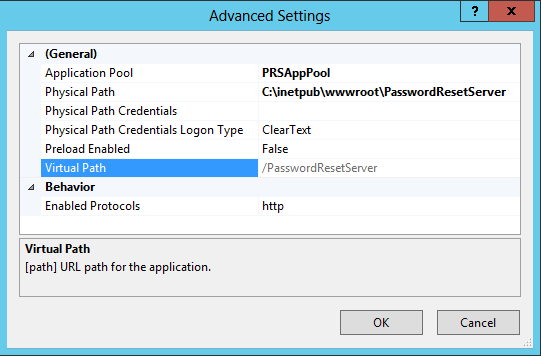

*Figure 2.1 – Specify Application Pool*

Appendix
========

Microsoft SQL Server 2012 Express Prerequisites
-----------------------------------------------

SQL Server 2012 Express requires some software to be installed before it can be
installed.

1.  Windows PowerShell 2.0.

2.  Microsoft .NET Framework 4.5.1.

3.  Windows Installer (Windows Installer 5.0 is included by default in Windows 8
    / Server 2012)

Only the Express Edition requires these components to be installed separately.
If you are installing another edition of SQL, such as Standard or Enterprise,
these components will be installed for you.

Installing PowerShell
---------------------

Windows PowerShell is included by default in Windows 8, Windows 8.1, and Windows
Server 2012 / R2.

Virtual Accounts
----------------

Virtual Accounts, or Managed Service Accounts, is a feature included in Windows
8 and Windows Server 2012. Windows will create a virtual account for the name of
the application pool. Thus, if your application pool’s name is DefaultAppPool
and its identity is set to ApplicationPoolIdentity, you would assign folder
permissions to the account IIS AppPool\\DefaultAppPool. This account can then
optionally be used to connect Secret Server to the SQL database by adding
db_owner access to the database as a Windows account. See [Adding a SQL Server
User](#adding-a-sql-server-user). For more information on virtual accounts as
application pool identities, see [this
article](http://www.iis.net/learn/manage/configuring-security/application-pool-identities)
by Microsoft.

Creating a Domain Account to Reset Passwords
--------------------------------------------

For Password Reset Server to reset passwords, it must be provided access to an
account that is able to reset passwords for the domain users. Instructions for
setting up the exact permissions are detailed below. We recommend creating a new
domain account that will only be used by Password Reset Server for this purpose:

You must be a member of the Domain Admins group to perform these steps.

1.  Open the Active Directory Users and Computers MMC snap-in and connect to
    your domain.

2.  Right click Users under your domain and select New \> User.

3.  In the Full name and User logon name fields, enter a descriptive name and
    unique username, respectively (Figure A). Click Next.

4.  Enter a strong password.

5.  Uncheck the User must change password at next logon box.

6.  Check the Password never expires and User cannot change password boxes
    (Figure B).

We recommended choosing “Password never expires” because if the password expires
and it is not changed, Password Reset Server will not be able to change
passwords for domain users.

1.  Click Next and Finish.

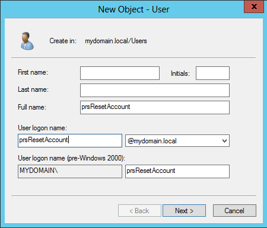

*Figure A – Configure New User Account*

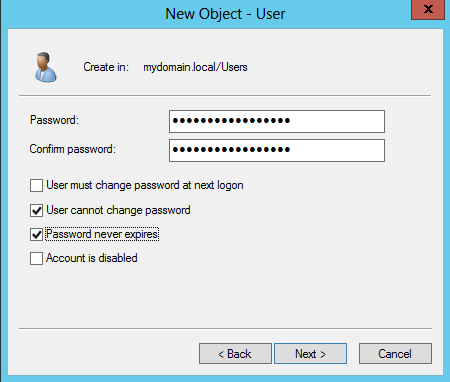

*Figure B – Configure New User Password*

The domain account used to synchronize and reset passwords for the domain must
have the following permissions to reset a user's account: Change Password, Reset
Password, Write lockoutTime*,* Write pwdLastSet.

1.  Configure the Active Directory Users and Computers to display Advanced
    Features by clicking View from the top menu, and then Advanced Features
    (Figure C).

2.  Select the top level domain node, right click, and select Delegate Control
    (Figure D).

If desired, you may apply the permissions to specific Organizational Units
instead of the entire domain. These actions must be repeated for each
Organizational Unit.

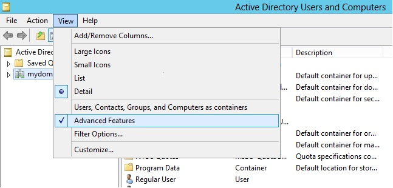

*Figure C – View Advanced Features*

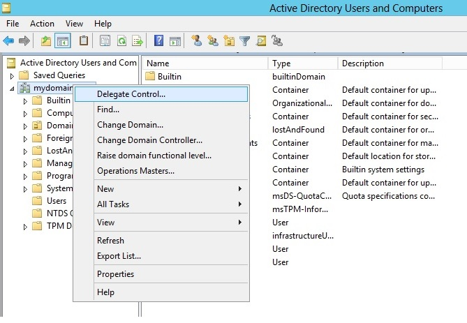

*Figure D – Delegate Control*

1.  Once the Delegation of Control Wizard window opens, click Next.

2.  On the Selected users and groups screen click Add.

3.  Select the user created above (Figures E,F). Click Next.

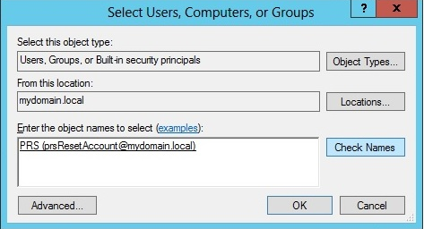

*Figure E – Select PRS Admin User*

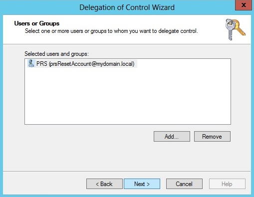

*Figure F – Confirm Selection of PRS Admin User*

1.  In the next window, select the “Create a custom task…” bubble (Figure G).
    Click Next.

2.  For Delegate control of, select the “Only the following…: option and check
    the User Objects box at the very bottom (Figure H). Click Next.

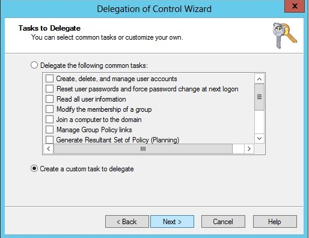

*Figure G – Create a custom task to delegate*

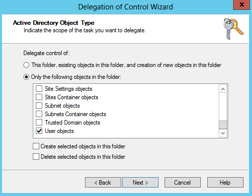

*Figure H – Select User Objects*

1.  Leave the General box checked, and select the “Read All Properties,” “Change
    password,” and “Reset password” check boxes below (Figure I). **If you plan
    to allow users to update Active Directory attributes through Password Reset
    Server as well, you will also need to give this account “Write All
    Properties” or permission to write the specific attribute(s).** Click Next
    and Finish.

2.  Repeat steps 9 through 14, then check only the Property-specific box and
    check the “**Write lockoutTime**” (Figure J), “**Write pwdLastSet**” (Figure
    K), and “**Write userAccountControl**” (Figure L) boxes. Click Next and
    Finish.

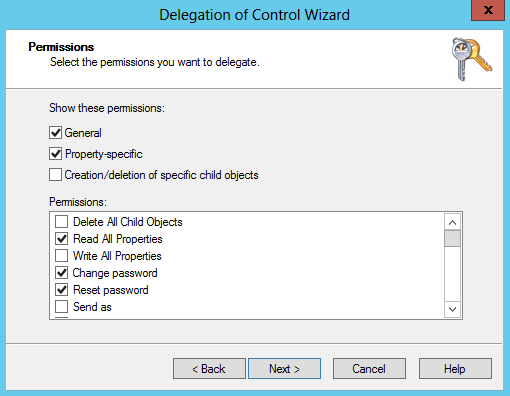

*Figure I – Delegate Change & Reset Password Permissions*

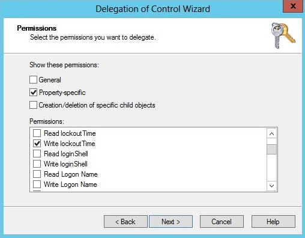

*Figure J – Delegate Write lockoutTime Permission*

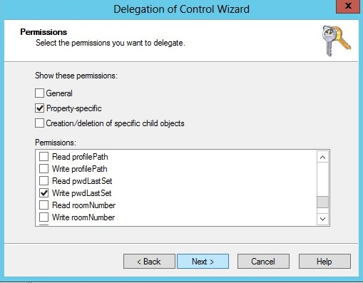

*Figure K – Delegate Write pwdLastSet Permission*

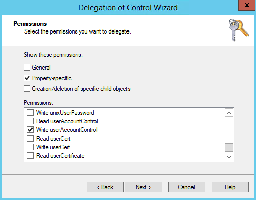

Figure L - Delegate Write userAccountControl Permission

You can now use this account to reset passwords using Password Reset Server.

You may want to modify your domain Group Policy to deny local login for this
account under User Rights Assignment.

SSL Certificate 
----------------

### What is an SSL Certificate? 

An SSL (Secure Sockets Layer) Certificate greatly enhances the security between
the user’s browser and the server Password Reset Server is installed on. It
encrypts all data between the server and the client’s browser so if an attacker
were to look at the data being transmitted between the two, they would not be
able to decipher it.

### Where can I obtain an SSL Certificate? 

A certificate can be obtained from various companies such as
[Thawte](http://www.thawte.com/) or [VeriSign](http://www.verisign.com/). It is
also possible to create your own, see [Creating and installing your
own](https://updates.thycotic.net/link.ashx?SSSelfSignedCertificate).
