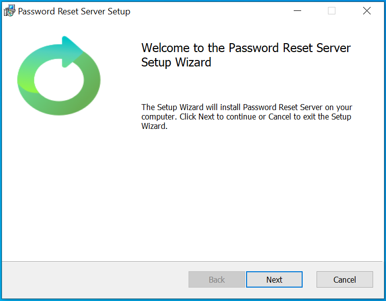
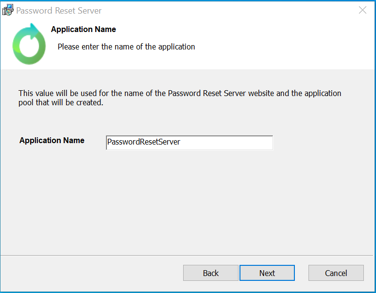
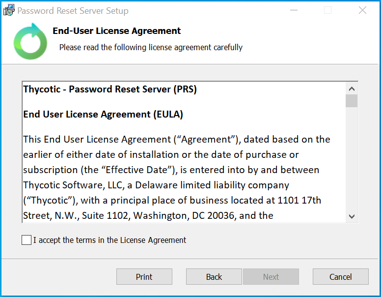
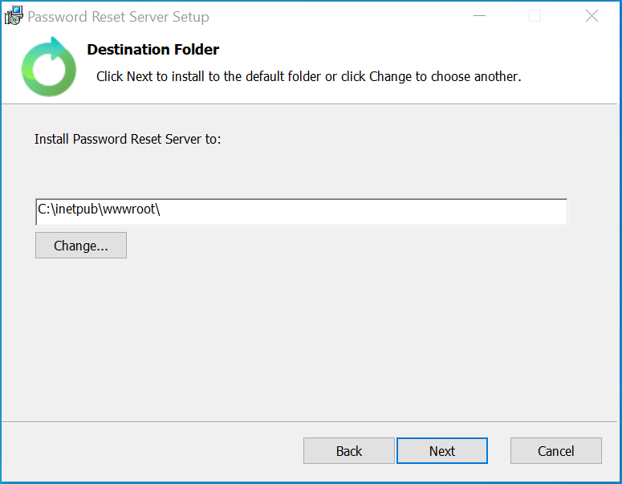
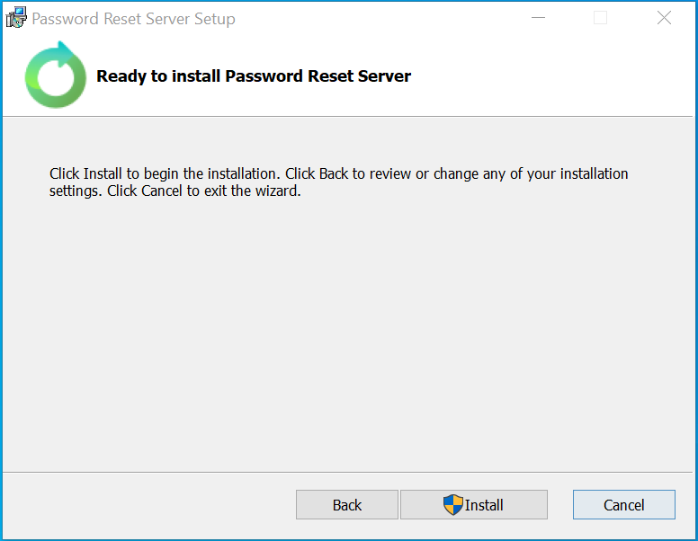
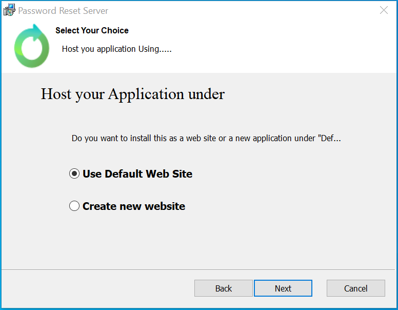
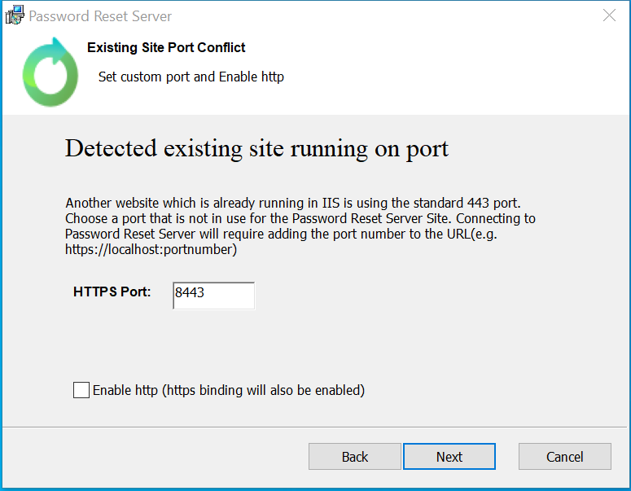

[title]: # (Installation)
[tags]: # (install)
[priority]: # (108)
# Installation

The following covers the steps for the Password Reset Server installer for versions 5.2.0 and later.
Ensure that IIS is enabled on the system you are installing Password Reset Server on.

1. Download the installer ZIP file and extract the contents for the MSI file.
1. Run the Installer file with Admin rights.
1. Click __Next__.

   
1. On the __Configure your installer__ page you can choose one of the following options:

   

   * __Standard:__ This option installs Password Reset Server as a virtual directory under the Default Website. This is recommended if you have existing sites using the Default Website, and is also the fastest way to get up and running.

   * __Advanced:__ This option installs Password Reset Server as a new website without using the Default Website. This allows you to specify a port number that the website will run under. Using this option assumes some knowledge of IIS and is often followed up by adding a DNS entry on the domain controller. This option must be used if there is no Default Website already present.

1. Select the option you would like to use and click __Next__.

## Standard Install

The following steps are for selecting the __Standard__ option in the install wizard.

1. Select the Standard option and click __Next__.

   
1. You can enter the __Application Name__ value that will be used in IIS. By default this is set to __PasswordResetServer__. You can keep the default or change the value to something else. Once the value is entered, click __Next__.

   
1. Review the End-User License Agreement and click the __I accept the terms in the License Agreement__ check-box if you agree to the terms.  

   
1. Click __Next__ after you agree to continue.

1. On the __Destination Folder__ page you can select what folder to install PRS under for IIS.

   
1. You can either Change the root directory to install the PRS files under or leave the default value `C:\inetpub\wwwroot\`.
1. After you have selected the folder to install PRS under, click the __Next__ button.  
1. All of the Standard steps are now complete, and you are ready to install Password Reset Server.

   
1. Click the __Install__ button to finalize the install and begin the file creation on your system.

## Advanced Install

The following steps are for selecting the Advanced option in the install wizard.

1. Select the Advanced option and click __Next__ to proceed.

   
1. On the __Select your Choice__ screen you can decide where to host the Password Reset Server application. There are two options:

   * __Use Default Web Site:__ This will host the application under the   default website in IIS. This includes defaulting to use HTTPS as well as using the default Port value.
   * __Create new website:__ This will create a new website in IIS to host the application (for Password Reset Server), and the new website will not be under the default site in IIS.

    
1. Clicking the __Next__ button when this option is selected will then take you to the __Existing Site Port Conflict__ screen (if a site is already detected in IIS).  

   

   * Users can either manually enter a __HTTPS Port__ value or they can use the value that is populated when they get to the page.
   * There is also a check-box to allow the configuration to enable HTTP support (including setting the HTTP port number) instead of requiring HTTPS support for the URL.

1. Once these options have been set, click __Next__ to continue.
1. After selecting the location to Host the application, you will be brought to the __Application Name__ page.

   
1. You can enter the __Application Name__ value that will be used in IIS. By default this is set to __PasswordResetServer__. You can keep the default or change the value to something else. Once the value is entered, click __Next__.
1. Review the End-User License Agreement and click the __I accept the terms in the License Agreement__ check-box if you agree to the terms and want to continue.

   
1. Click __Next__ after you agree to continue.
1. On the __Destination Folder__ page you can select what folder to install PRS under for IIS.

   
1. You can either Change the root directory to install the PRS files under or leave the default value (C:\inetpub\wwwroot\).
1. After you have selected the folder to install PRS under, click the __Next__ button.
1. All of the Advanced steps are now complete, and you are ready to install Password Reset Server.

   
1. Click the __Install__ button to finalize the install and begin the file creation on your system.
1. Once the install has run you will be prompted to finish the installer. You can close the Installer dialog by clicking the __Finish__ button.

This part of the installation is complete.  The website will be set up with the correct permissions and the browser will open to allow you to complete the Password Reset Server installation from the webpage. [The following section will guide you through this process](/installation\prs-website\index.md)