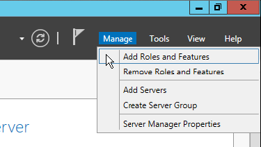
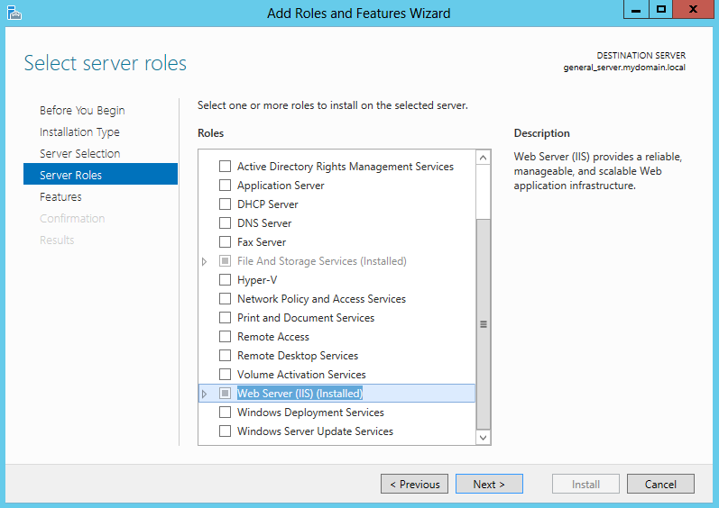
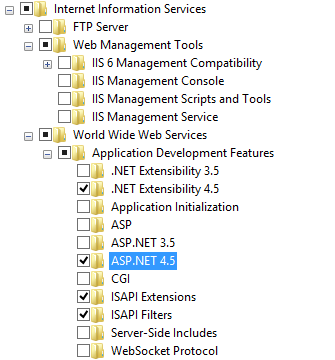
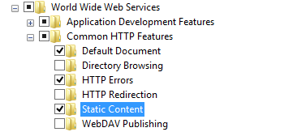

[title]: # (Installing IIS)
[tags]: # (welcome)
[priority]: # (2)
# Installing IIS

IIS is an internal part of the Microsoft Windows operating system. Installing it
will vary depending on which version of the operating system you are using.

## Windows Server 2012 / Windows Server 2012 R2

To install Internet Information Services on Windows Server 2012 or Windows
Server 2012 R2, you will give your server the Web Server (IIS) role.

1.  Begin by opening the Server Manager and clicking Manage, then Add Roles and
    Features:

*Figure 1.1 – Add Roles and Features*

1.  Click Next until reaching the Installation Type screen. Select Role-based or
    feature-based installation and click Next.

2.  Select your Server (it should be selected by default) and click Next.

3.  Check the Web Server (IIS) box, then expand the category (see Figure 2.2 on
    the following page).

4.  Expand Web Server \> Application Development and check the **ASP.NET 4.5**
    box (Figure 2.3).

5.  Expand Common HTTP Features and ensure that the Static Content, Default
    Document, and HTTP Errors boxes are checked as well. Click Next, and then
    Add Features.

*Figure 1.2 – Choose the IIS Role*

*Figure 1.3 – Select ASP.NET 4.5*

## Windows 8 / 8.1

Please ensure you have your Windows installation disk available if the system
asks for it. This disk should have been included with the System Manufacturer or
the Administrator that installed Windows on that machine.

1.  From the Desktop, start by tapping the Windows key, then type Control Panel
    and hit Enter.

2.  Open the Programs Control Panel item, and then Programs and Features.

3.  Click Turn Windows Features on or off.

4.  A dialog will appear. It may take a moment or two for the system to load.
    Expanding Internet Information Services \> World Wide Web Services \>
    Application Development Features and checking **ASP.NET 4.5** will also
    check other needed dependencies (see Figure 1.1 on the following page).

5.  Expand Common Http Features and check the following:

    1.  Static Content (if this is not checked, the application images will not
        appear)

    2.  Default Document

6.  Ensure that .NET Framework 4.5 is already checked. If not, check this box as
    well.

7.  Click OK. At this point, Windows will now install IIS (see Figure 1.2). It
    may ask you for your operating system’s disk.

8.  IIS is now installed. Depending on your operating system, Windows may ask
    you to restart your computer.

9.  You can verify the installation of IIS by tapping the Windows key from your
    Desktop and typing IIS. Search results should return Internet Information
    Services (IIS) Manager.

10. We recommend running Windows Updates to receive the latest security patches
    for IIS once you have installed it.

*Figure 2.1 – Selecting additional features*

*Figure 2.2 – Installing additional features*