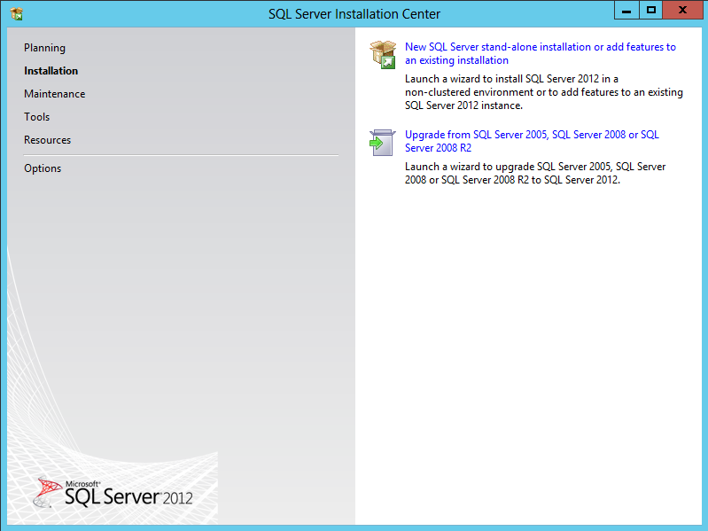
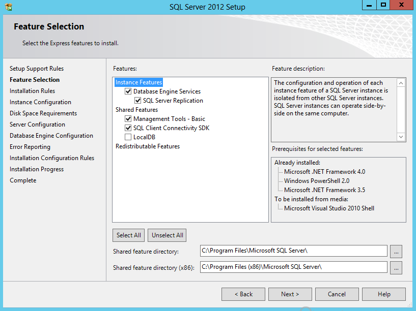
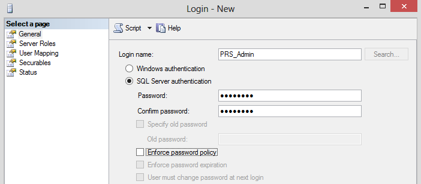

[title]: # (Installing and Configuring Microsoft SQL Server)
[tags]: # (sql)
[priority]: # (106)

# Installing and Configuring Microsoft SQL Server

We recommend using Microsoft SQL Server 2012 or 2008. A free edition called Microsoft SQL Server Express is available to [download](https://updates.thycotic.net/link.ashx?SQLServerExpressDownload). See the [appendix](../../../appendix/index.md) for details on software prerequisites.

If using SQL Server 2008, SQL Server 2008 SP1 should be installed immediately after the installation is complete to resolve compatibility issues with Windows 7 and Windows Server 2008 R2.

## Installing Microsoft SQL Sever

The instructions given below are for Microsoft SQL Server 2012 Express Edition with Tools. The installation processes for other editions such as Enterprise or Standard may be similar, but not the same.

There are several editions of Microsoft SQL Server 2012 Express. We recommend downloading Microsoft SQL Server 2012 Express with Tools. [This KB article](https://updates.thycotic.net/link.ashx?SQLServerExpressDownload) has the link on Microsoft’s site.

1. Download the installation package, right-click it and select Run as Administrator.

2. From the welcome screen, select Installation from the left menu.

3. Select the New SQL Server option (see Figure 1.1, on the following page).

4. SQL Server will then initialize your installation.

5. Accept the license terms and click Next.

6. Click Next once more to install the setup files.

7. In the following Window (Figure 1.2), ensure that Database Engine Services and Management Tools – Basic are both selected. Click Next.

8. In the Instance Configuration step, the default settings can be left (Named instance: SQLEXPRESS is the default). Click Next.

9. For Server Configuration, change the SQL Server Database Engine Account Name to NT AUTHORITY\\NETWORK SERVICE. Click Next.

   

   *Figure 1.1 – SQL Server Installation Center*

   

   *Figure 1.2 – SQL Server Feature Selection*

10. For Database Engine Configuration, choose Mixed Mode or Windows mode:

- *Mixed Mode (recommended for easiest configuration)* - Mixed Mode is
    required if you intend on using a SQL Server account to authenticate
    Password Reset Server to your SQL Server. If you are doing an evaluation and
    using the Password Reset Server MSI, we recommend Mixed Mode with a SQL
    Authentication account. See [Creating the SQL Server User](#Adding a SQL Server User) (below) for instructions.

- *Windows Mode (recommended for best security)* - This will prevent SQL
    Server account authentication and requires a Windows Service account to run
    the Password Reset Server website. This will also require additional
    configuration in IIS once Password Reset Server is installed. [This KB
    article](https://updates.thycotic.net/link.ashx?DBWindowsAuth) walks through
    the advanced setup. This mode is recommended as a best practice.

11. Click Add Current User under the SQL Server administrators box. Click Next.

12. Click Next once more to complete the installation.

We recommend running Microsoft Update to get all of the latest service packs and
fixes for SQL 2012.

## Creating the Database

1. Open SQL Server Management Studio.

2. Connect to your SQL database.

3. Right click the Databases folder and select New Database.

4. Enter a database name and click OK.

## Adding a SQL Server User

1. Open SQL Server Management Studio.

2. Connect to your SQL database.

3. Expand the Security folder.

4. Right click Logins and select New Login.

    1. To create a **local SQL account**, select SQL Server authentication
        (this requires Mixed Mode to be enabled).

        1. Enter a login name (username) and password.

        2. Uncheck the Enforce password policy box to prevent the account from
            expiring.

    2. To add a **Windows account**, select Windows authentication.

        1. Enter a login name in the form of domain\\username, or click Search
            to search for the domain account.

5. Select the User Mappings from the left menu.

6. Check the checkbox next to your Password Reset Server database.

7. Check the db_owner box.

8. Click OK.

   

   *Figure 3.1 – Creating a SQL user*