[title]: # (SQL Server 2012)
[tags]: # (requirements)
[priority]: # (102)
# SQL Server 2012 Express Prerequisites

SQL Server 2012 Express requires some software to be installed before it can be installed.

1. Windows PowerShell 2.0.

2. Microsoft .NET Framework 4.5.1.

3. Windows Installer (Windows Installer 5.0 is included by default in Windows 8 / Server 2012)

Only the Express Edition requires these components to be installed separately. If you are installing another edition of SQL, such as Standard or Enterprise, these components will be installed for you.

**Please Note**: Secret Server and Password Reset Server require SQL_Latin1_General_CP1_CI_AS to be the default collation for Microsoft SQL Server and its database. Using a different default collation will cause the installation to fail. See Microsoft SQL [collation requirements](https://docs.microsoft.com/en-us/sql/relational-databases/collations/collation-and-unicode-support?view=sql-server-ver15) and check your server collation settings before upgrading.

## Installing PowerShell

Windows PowerShell is included by default in Windows 8, Windows 8.1, and Windows Server 2012 / R2.

## Virtual Accounts

Virtual Accounts, or Managed Service Accounts, is a feature included in Windows 8 and Windows Server 2012. Windows will create a virtual account for the name of the application pool. Thus, if your application pool’s name is DefaultAppPool and its identity is set to ApplicationPoolIdentity, you would assign folder permissions to the account IIS AppPool\\DefaultAppPool. This account can then optionally be used to connect Secret Server to the SQL database by adding db_owner access to the database as a Windows account. See *Adding a SQL Server User*. For more information on virtual accounts as application pool identities, see [this article](http://www.iis.net/learn/manage/configuring-security/application-pool-identities) by Microsoft.

## Creating a domain account to reset passwords

For Password Reset Server to reset passwords, it must be provided access to an account that is able to reset passwords for the domain users. Instructions for setting up the exact permissions are detailed below. We recommend creating a new domain account that will only be used by Password Reset Server for this purpose:

You must be a member of the Domain Admins group to perform these steps.

1. Open the Active Directory Users and Computers MMC snap-in and connect to your domain.

2. Right click Users under your domain and select New \> User.

3. In the Full name and User logon name fields, enter a descriptive name and unique username, respectively (Figure A). Click Next.

4. Enter a strong password.

5. Uncheck the User must change password at next logon box.

6. Check the Password never expires and User cannot change password boxes (Figure B).

   We recommended choosing “Password never expires” because if the password expires and it is not changed, Password Reset Server will not be able to change passwords for domain users.

7. Click Next and Finish.

   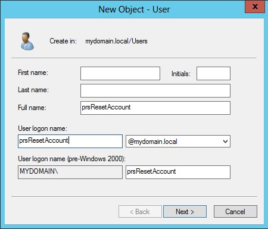

   *Figure A – Configure New User Account*

   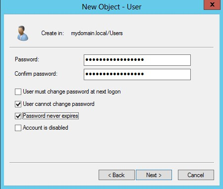

   *Figure B – Configure New User Password*

   The domain account used to synchronize and reset passwords for the domain must have the following permissions to reset a user's account: Change Password, Reset Password, Write lockoutTime*,* Write pwdLastSet.

8. Configure the Active Directory Users and Computers to display Advanced Features by clicking View from the top menu, and then Advanced Features (Figure C).

9. Select the top level domain node, right click, and select Delegate Control (Figure D).

   If desired, you may apply the permissions to specific Organizational Units instead of the entire domain. These actions must be repeated for each Organizational Unit.

   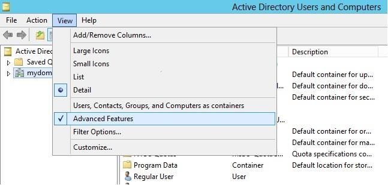

   *Figure C – View Advanced Features*

   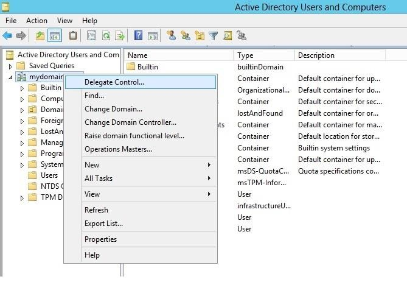

   *Figure D – Delegate Control*

10. Once the Delegation of Control Wizard window opens, click Next.

11. On the Selected users and groups screen click Add.

12. Select the user created above (Figures E,F). Click Next.

      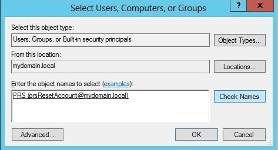

      *Figure E – Select PRS Admin User*

      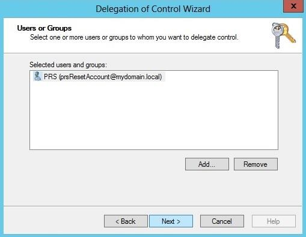

      *Figure F – Confirm Selection of PRS Admin User*

13. In the next window, select the “Create a custom task…” bubble (Figure G). Click Next.

14. For Delegate control of, select the “Only the following…: option and check the User Objects box at the very bottom (Figure H). Click Next.

      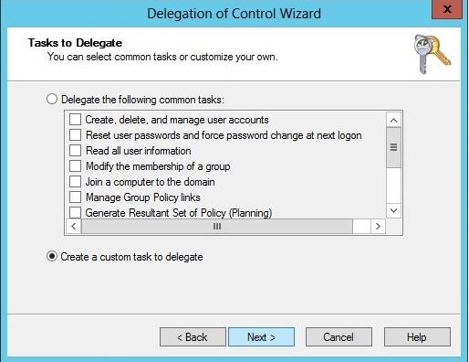

      *Figure G – Create a custom task to delegate*

      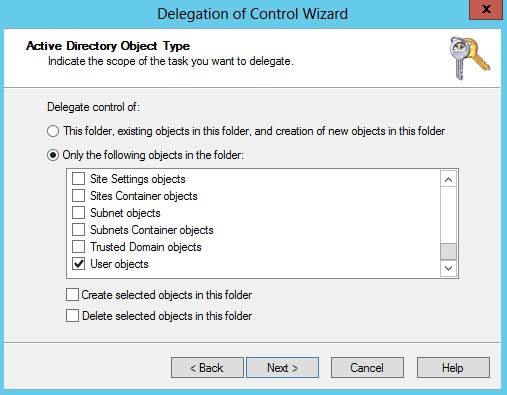

      *Figure H – Select User Objects*

15. Leave the General box checked, and select the “Read All Properties,” “Change password,” and “Reset password” check boxes below (Figure I). **If you plan to allow users to update Active Directory attributes through Password Reset Server as well, you will also need to give this account “Write All Properties” or permission to write the specific attribute(s).** Click Next and Finish.

16. Repeat steps 9 through 14, then check only the Property-specific box and check the “**Write lockoutTime**” (Figure J), “**Write pwdLastSet**” (Figure K), and “**Write userAccountControl**” (Figure L) boxes. Click Next and Finish.

      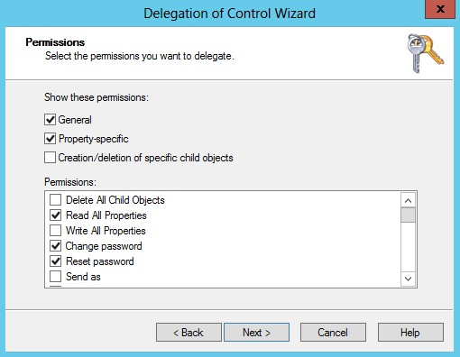

      *Figure I – Delegate Change & Reset Password Permissions*

      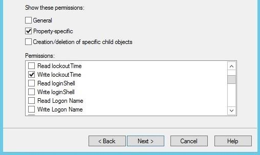

      *Figure J – Delegate Write lockoutTime Permission*

      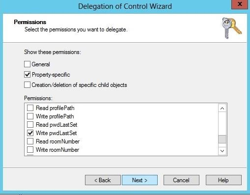

      *Figure K – Delegate Write pwdLastSet Permission*

      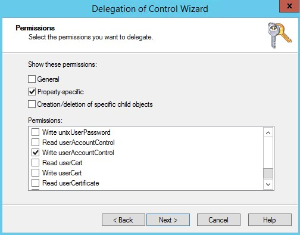

      *Figure L - Delegate Write userAccountControl Permission*

You can now use this account to reset passwords using Password Reset Server.

You may want to modify your domain Group Policy to deny local login for this account under User Rights Assignment.

## SSL Certificate

### What is an SSL Certificate?

An SSL (Secure Sockets Layer) Certificate greatly enhances the security between the user’s browser and the server Password Reset Server is installed on. It encrypts all data between the server and the client’s browser so if an attacker were to look at the data being transmitted between the two, they would not be able to decipher it.

### Where can I obtain an SSL Certificate?

A certificate can be obtained from various companies such as [Thawte](http://www.thawte.com/) or [VeriSign.](http://www.verisign.com/) It is also possible to create your own, see [Creating and installing your own.](https://updates.thycotic.net/link.ashx?SSSelfSignedCertificate)

## Software Requirements

- One of the following operating systems:

    - Windows 8 or 8.1

       **Note:** Windows 8 and 8.1 are only supported for testing environments. Microsoft does not support either of these operating systems being used as a production server environment.

    - Window Server 2012 or 2012 R2

      **Note:** Both 32-bit and 64-bit editions of Windows Server are supported. You must install the proper version of the .NET Framework to support 64-bit.

- Microsoft SQL Server 2005, 2008 or 2012, including R2 (any edition)

- Microsoft **Internet Information Services** (IIS) (internal part of the operating system)

- **Microsoft .NET Framework 4.5.1 / 4.5.2** (both 32-bit and 64-bit editions are supported)

**Note:** Windows 8 / 8.1 and Windows Server 2012 / R2 come with the .NET Framework 4.5.1 already installed. If you are using Windows 8 or Windows Server 2012, you should already have .NET Framework 4.5 but will need to upgrade to .NET Framework 4.5.1 / 4.5.2. Find the installer provided by Microsoft [here](http://www.microsoft.com/en-us/download/details.aspx?id=40779).

## Domain Account Requirements

Each domain will need a domain account to synchronize the users and reset passwords. See the [Appendix](../../../../sys-req.md) for instructions to set up the domain account.

## Additional Recommendations

- Run [Microsoft Update](http://update.microsoft.com/) on your server to make sure all components are up to date.