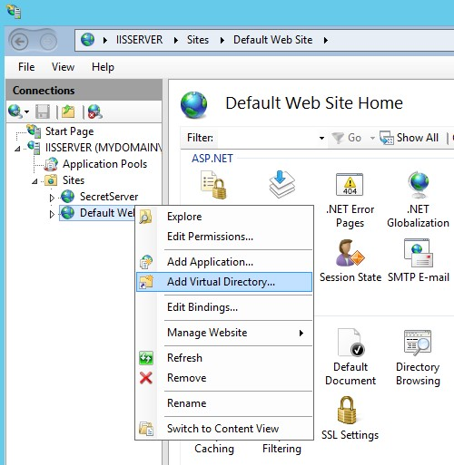
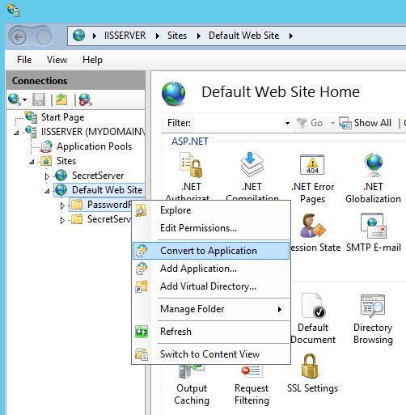
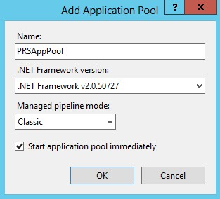
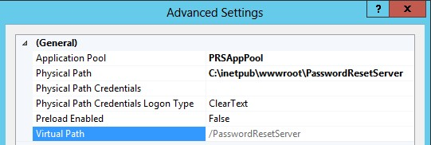

[title]: # (Manual Installation)
[tags]: # (manual, install)
[priority]: # (109)

# Manual Installation (No MSI)

If you are knowledgeable of IIS and would prefer to manually install the website without using the MSI, you can follow these instructions.

[Download](https://updates.thycotic.net/links.ashx?prsofflinefile) the latest version of Password Reset Server. You can choose to download a ZIP file that contains the Password Reset Server files. Use this ZIP file for the instructions below.

Password Reset Server can be installed in a few different ways:

- As a virtual directory

- As a website

- As part of a website

Make sure you have the *required software* installed before attempting to setup Password Reset Server.

## Installing as a virtual directory

1. Extract the contents of the ZIP file where you would like Password Reset Server to be located on your system.

2. Open the IIS Control Panel by going into the Control Panel, then Administrative Tools \> Internet Information Services (IIS) Manager.

3. Highlight the Default Web Site, right-click it and select Add Virtual Directory (see Figure 1.1 below).

4. Select an alias for your Password Reset Server. The alias is what will be appended to the website. For instance, *http://myserver/PasswordResetServer*.

5. Select the physical directory for where you unzipped Password Reset Server.

6. In the tree, right-click the virtual directory and select Convert to Application. Click OK.

7. Click the Application Pools node, then highlight the application pool running Password Reset Server. Click Advanced Settings in the right pane. Under Process Model, set Identity to a Windows service account or leave the default ApplicationPoolIdentity (Figure 1.2).

   Windows 8 / Server 2012 will default the application pool to a virtual identity, ApplicationPoolIdentity. For easiest configuration, use either this or NETWORK SERVICE as the identity. For better security, you can specify your own Windows service account. See the *Appendix* for further information on using a virtual identity for Password Reset Server in IIS.

   

   *Figure 1.1 – Add Virtual Directory* 

   

   *Figure 1.2 – Convert to Application* 

8. Ensure that the Password Reset Server folder has the proper permissions by checking that the account running the application pool in IIS has Modify permissions on the folder where Password Reset Server is installed.

Password Reset Server is now ready to be installed. See *Completing Password Reset Server installation*.

## Installing as part of a website

1. Extract the contents of the ZIP file where you would like Password Reset Server to be located on your system (a common location is C:\\inetpub\\wwwroot).

2. Open the IIS Control Panel by going into the Control Panel, then Administrative Tools \> Internet Information Services (IIS) Manager.

3. Expand the Default Website and locate the Password Reset Server folder. Right-click it, and select Convert to Application. Click OK.

4. Click the Application Pools node, then highlight the application pool running Password Reset Server. Click Advanced Settings in the right pane. Under Process Model, set Identity to a Windows service account or leave the default ApplicationPoolIdentity (Figure 1.2, see the previous page).

   Windows 8 / Server 2012 will default the application pool to a virtual identity, ApplicationPoolIdentity. For easiest configuration, use either this or NETWORK SERVICE as the identity. For better security, you can specify your own Windows service account. See the *Appendix* for further information on using a virtual identity for Password Reset Server in IIS.

5. Ensure that the Password Reset Server folder has the proper permissions by checking that the account running the application pool in IIS has Modify permissions on the folder where Password Reset Server is installed.

Password Reset Server is now ready to be installed. See *Completing Password Reset Server installation*.

## Configuring the pipeline

Password Reset Server is by default placed in the DefaultAppPool application pool, which may not be set to use the correct pipeline for Password Reset Server. PRS requires that the application pool’s managed pipeline mode be set to Classic. This can be done by modifying the application pool settings or creating a new one.

It is recommended that you create a new application pool if you have other web applications running on the server. This will help avoid changing the configuration for another application.

### Changing the Pipeline Mode

1. In the Internet Information Services (IIS) Manager, select the Application Pools node.

2. Double-click the DefaultAppPool.

3. Set Managed Pipeline Mode to Classic. Click OK.

   

   *IIS Application Pool - Windows 8 IIS Application Pool - Windows 8.1*

The Windows Server 2012 R2 and Windows 8.1 application pool window will appear slightly different than in Windows Server 2012 and Windows 8.

### Creating a New Application Pool

1. In the Internet Information Services (IIS) Manager, right-click the Application Pools node and select Add Application Pool.

2. Enter a name for your application pool.

3. Ensure that the .NET Framework Version or CLR is set to .NET Framework v4.0.30319.

4. Set Managed Pipeline Mode to Classic. Click OK.

5. Right-click the virtual directory in IIS and select Manage Application \> Advanced Settings.

6. In the new window, change Application Pool to the one we just created.

   

   *Figure 2.1 – Specify Application Pool*