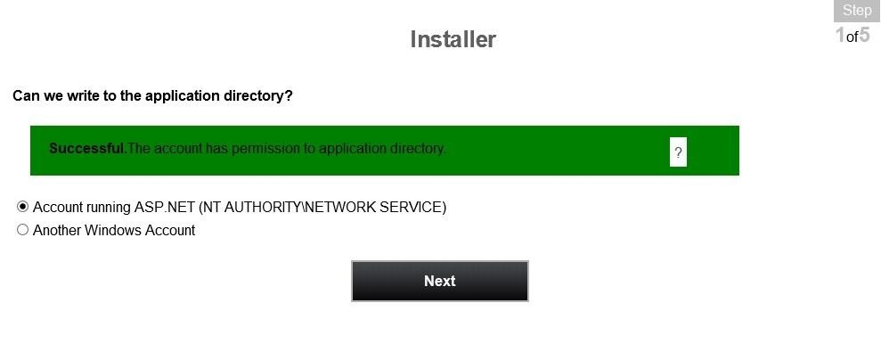
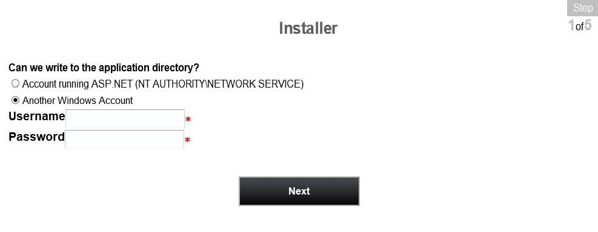
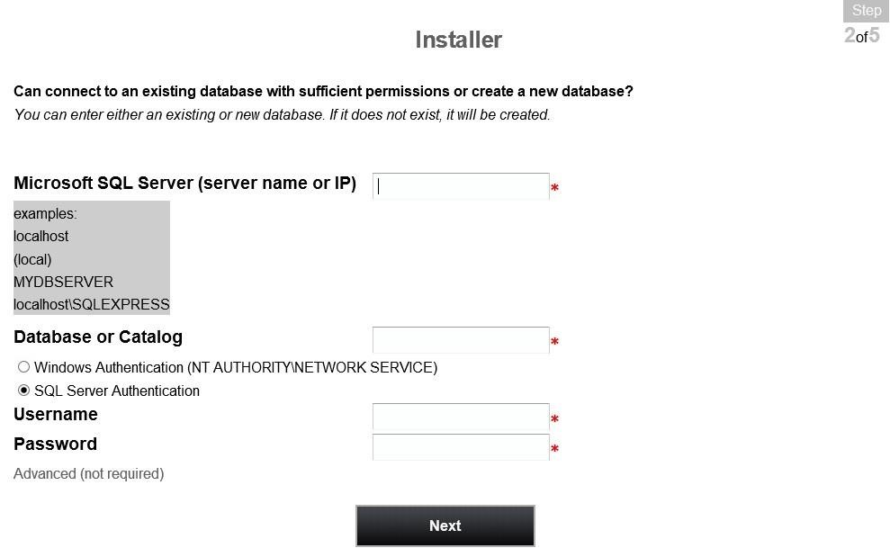
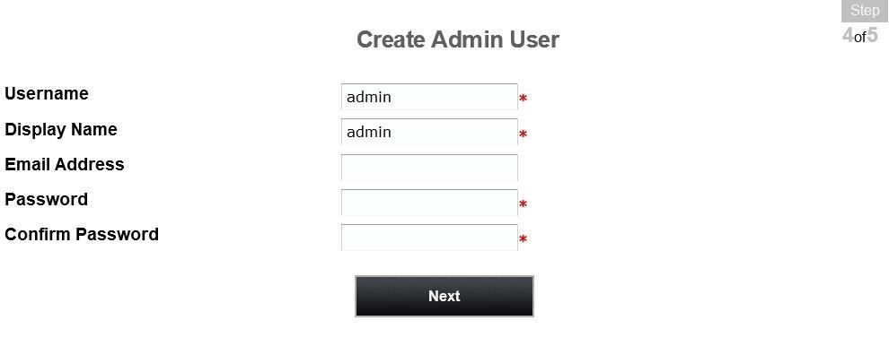
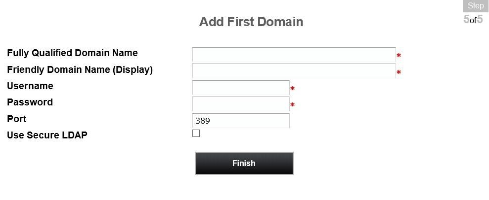

[title]: # (Completing PRS installation from the website)
[tags]: # (website, install)
[priority]: # (108)

# Completing Password Reset Server installation from the website

Password Reset Server is now ready to begin installation through its installer. Open a browser and browse to where your Password Reset Server is located, for example:

*http://localhost/passwordresetserver* 

Password Reset Server has a 5-step installation process:

1. Step 1 ensures that the identity running the Password Reset Server application pool has write access to the application directory. The account running the IIS application pool requires modify permission (this includes     the write permission) to the application folder to continue.

   

   If you don’t want to change the permissions of a folder, you can give Password Reset Server a Windows username and password that has modify permissions already, and Password Reset Server will “impersonate” as that user during the installation process.

   

   Password Reset Server only needs write permission during installation and upgrade. You can remove the write and modify permissions once the installation process is complete.

   Once the permissions are set, click Next.

See the *Manual Installation* section for more information on account permissions.

2. In Step 2, specify the database. If Password Reset Server is installed on the same machine as SQL Server, you can type (local). If you are using a named instance of SQL, use a slash then the instance name, for instance: (local)\\InstanceName. If you are not sure of the instance name, you can open SQL Server Management Studio and select Connect. The full instance name used here is the same one that will be used by Password Reset Server, for example THYCO1\\SQLEXPRESS.

   

Password Reset Server will create the database for you if it does not exist.

Enter the SQL Username and Password if using SQL Server Authentication, or select Windows Authentication. To create a SQL Server user, see *Creating the SQL Server User*.

3. Review the EULA and check the I Agree box, then click Continue to accept the agreement. Otherwise, Password Reset Server will not be installed.

4. Password Reset Server will now ask you to create your first user. This user will be a local administrator that will be used to configure your Password Reset Server. We recommend choosing a strong password.

   

5. Step 5 will prompt you to enter a domain and credentials for a domain account that has the required permissions to reset passwords on the domain. See *Creating a Domain Account to Reset Passwords*.

   

The domain name needs to be the Fully Qualified Domain Name (FQDN), for example: use *domain.thycotic.com* instead of *domain*.

Password Reset Server has now successfully been installed. For more information on configuring and maintaining your Password Reset Server, please see our [User Guide.](https://updates.thycotic.net/link.ashx?PRSUserGuide)