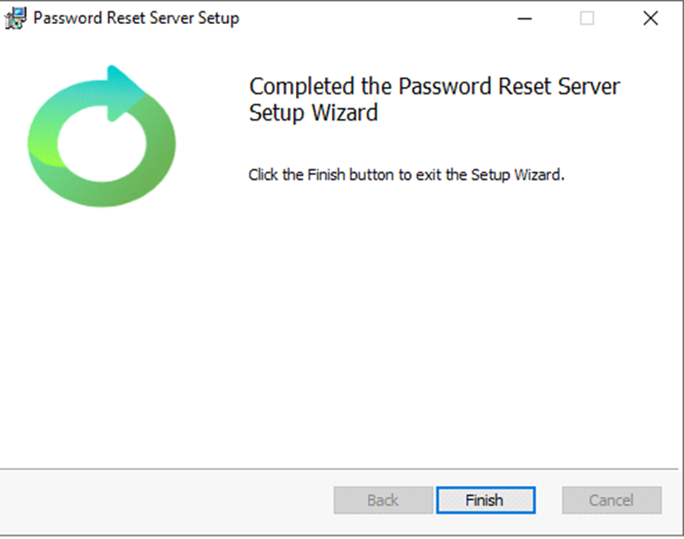

[title]: # (Upgrade)
[tags]: # (upgrade)
[priority]: # (109)
# Upgrading Password Reset Server 

This does not impact a fresh install and the following steps should only be used for upgrade purposes. Some servers have their file upload limits set too low. Before upgrading, be sure to check your IIS server and web application settings to ensure the upgrade process completes.

### Steps before Upgrading

1. Stop the IIS Server
1. Go to the PRS install directory default path is `C:\inetpub\wwwroot\PasswordResetServer`. This is root of where Password Reset Server is installed.
1. Look for the `web.config` file.

   >**Note:** It is suggested to create a back up before making any changes to the `web.config` file.

1. Open the web.config file in notepad and look for the `system.webServer` tag.
1. Add the following entry just below the `system.webServer`

   ```
    <security>
     <requestFiltering>
      <requestLimits maxAllowedContentLength="131072000" />
     </requestFiltering>
    </security>
   ```

1. Search for the `location path="InstallerCheckForUpdates.aspx"` tag.
1. Inside this tag update the __maxRequestLength__ value to "128000"
  and __execution timeout__ value to 1100.

   Example:
`<httpRuntime maxRequestLength="128000" executionTimeout="1100"/>`

1. Save the `web.config` file.
1. Restart __IIS__.
1. Use the normal upgrade process to upgrade Password Reset Server.

## Upgrading from an older version of Password Reset Server

When upgrading from older version of Password Reset Server it is recommended to use the in-product upgrade page to begin this process. This page can be accessed from (depending on your permissions) “https://YourPasswordResetServerURL/installer.aspx".

If Password Reset Server is already installed in your environment and you attempt to re-run the installer, the installer process will try to detect if PRS is already configured and, if detected, will prompt you to perform the upgrade using the page above.

   

# Manual Upgrade

Password Reset Server periodically polls our update server to detect for updates. However, if your Password Reset Server is on an internal network that does not have outbound access or goes through a proxy, it will not be able to perform updates.

As of 2.1.00000 (for older version please contact support), the recommended method is the using 'Advanced options' to manually select and upload the upgrade file.
