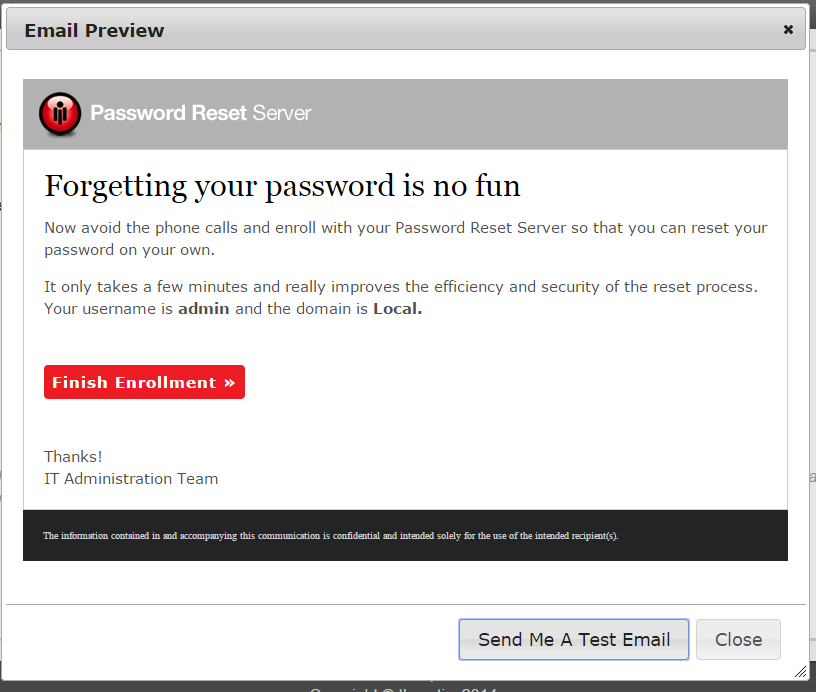
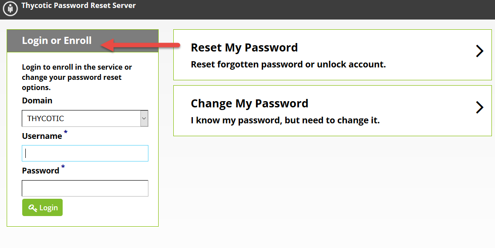
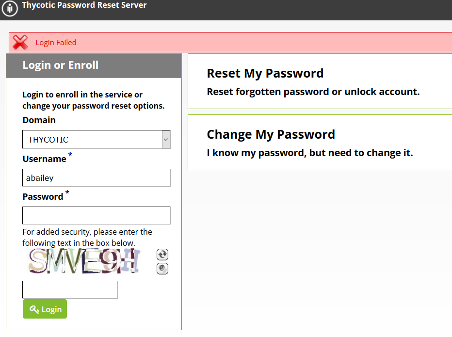

[title]: # (Getting Started)
[tags]: # (enroll)
[priority]: # (1)

# Getting Started

Begin by clicking the enrollment link sent to you by email or by going to the Password Reset Server URL (\*see system administrator).

Click **Enroll**, then select the domain that you normally log onto and enter your current username and password. Click **Log In**.

If you enter an incorrect username and/or password multiple times, you may be required to complete a CAPTCHA challenge in order to log in or enroll.

If you continue entering an incorrect password for your username, your account may be locked out and you will need to wait a period of time determined by your administrator before you may attempt to log in or enroll again. If you are already enrolled, you may go through the password reset process to unlock your account.