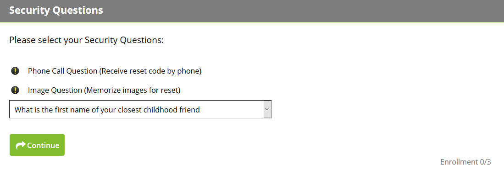
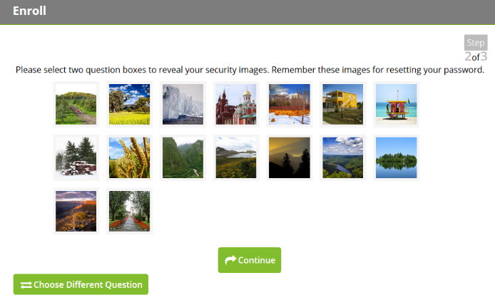
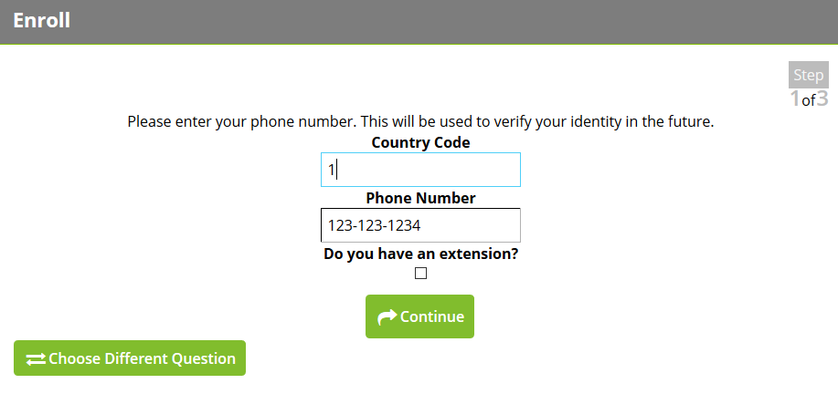
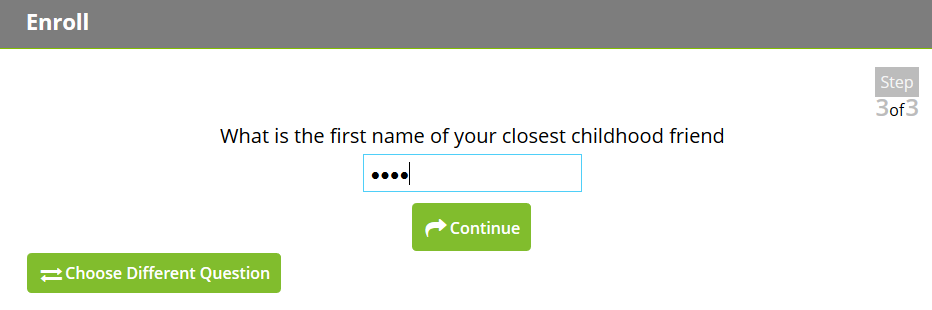

[title]: # (User Information)
[tags]: # (enroll)
[priority]: # (2)

# User Information

Now you will start enrollment by answering the security questions as they appear on screen (i.e. Question/Graphic/Phone).

