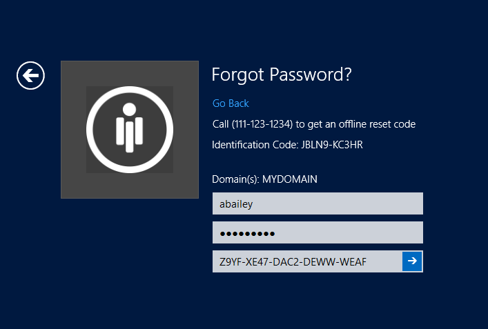

[title]: # (Offline Reset)
[tags]: # (offline, reset, password)
[priority]: # (4)

# Offline Reset

Offline password reset allows you to reset your password when you are traveling or not connected to the company domain.

To reset your password on your computer you will first need a reset code. You can get your reset code by either calling the help desk, or logging into the password reset server portal through your smartphone or an internet connected computer.

To start the offline reset, click the Forgot Password icon on your computer logon screen and click **Reset My Password Offline**

You will be given an identification code to provide to the help desk or the Password Reset Server website.

You can either call the help desk to get your offline reset code, or answer your reset questions by navigating to the Password Reset Server website from your phone or an internet connected computer.

## Web Portal

After answering your reset questions, expand the offline reset link to put in your identification code.

You will be given a reset code

Enter the reset code into the windows logon screen along with your new password

After changing your password you will be able to log in as normal.