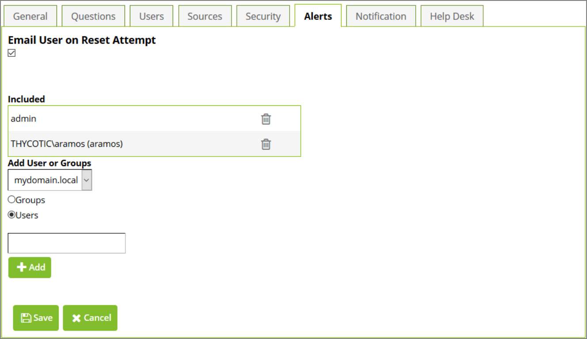

[title]: # (Alerts)
[tags]: # (alerts)
[priority]: # (5)
# Alerts

To view or edit the alerts, click the __Alerts__ tab at the top of the security policy overview.

   
Alerts allow specific users or group members to receive an email when a user or group member that is assigned that security policy completes the enrollment or when they attempt to reset their password.

To make additional users and groups receive alerts, enter the user or group in the search box and click __Add__. To stop users and groups from receiving alerts, click the __X__ next to the user or group name.