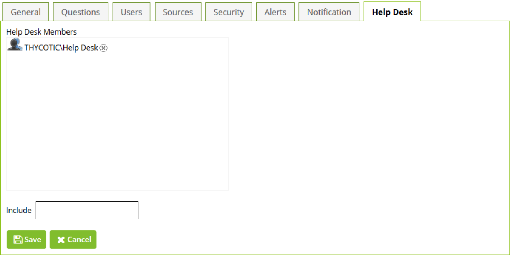

[title]: # (Adding Users to a Help Desk)
[tags]: # (help desk)
[priority]: # (7)
# Adding Users to a Help Desk

On the __Help Desk__ tab of any security policy, type a user or group name in the search field and an
autocomplete drop-down list will display possible matches.

   

>**Note:** Any user added to a help desk for a security policy will be able to reset the passwords of any user
in that security policy. Any user who is a member of a group assigned to a help desk of a security policy
will be able to reset the passwords of any user in that security policy.