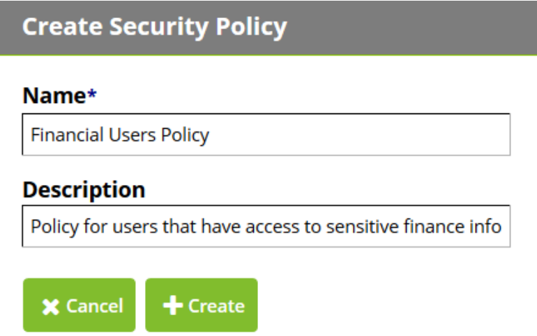

[title]: # (Security Policies)
[tags]: # (policies)
[priority]: # (1)
# Security Policies

A security policy is a set of questions defined by the administrator that users must answer to complete
their enrollment. Password Reset Server ships with a default security policy; however, an administrator
can change the security policy to meet the company or industry security requirements. Multiple policies
can be created which allow different users to answer different sets of questions. This allows stronger
policies to exist for more privileged domain accounts, or having different sets of questions per group if
the security policy is specific to a group of people. A single user, group, or organizational unit can only
belong to one security policy at a time.

An administrator can view or modify security policies by logging into Password Reset Server and selecting
__Security Policies__ from the __Administration menu__.

## Creating a new Security Policy

From the __Security Policies__ administrative page, click __Create__. You can then type the name of your new
security policy, such as “Financial Users Policy,” and a description that will help describe who this security
policy applies to. Click __Create__ to create the new security policy.

   

## Modifying an Existing Security Policy

To modify an existing security policy, select __Security Policies__ from the __Administration__ menu and then
click the name of the policy you would like to configure.

## Configuring a Security Policy

After creating a new security policy or modifying an existing one, you can configure it and tailor it to
meet your requirements.

To edit the description or name of a security policy, click __Edit__ on the security policy overview page, or
click __Activate__ to enable the security policy. An inactive security policy means that users can no longer be
assigned to it.

>**Note:** A security policy cannot be activated unless at least one question is assigned to it. By default, new
policies do not have any questions.
