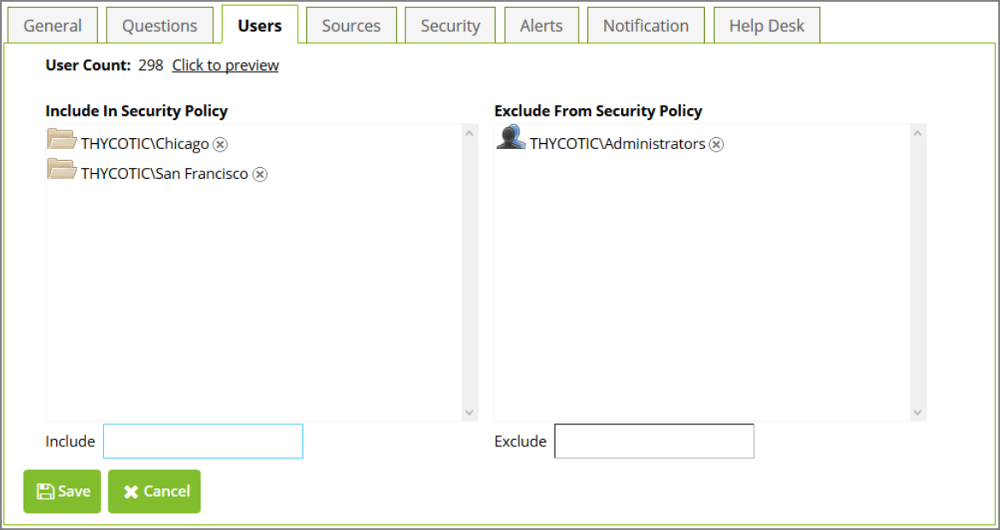

[title]: # (Configuring Security Policy Members)
[tags]: # (security)
[priority]: # (2)
# Configuring Security Policy Members

Users may be assigned to a security policy directly, by Organizational Unit (OU), or by group. To view
OU’s, groups, and users that are part of the security policy, click the __Users__ tab at the top of the overview
of the security policy.

To add new users, either directly or by group or OU, first click __Users__, then click __Edit__. Next, type the name
of the object you want to include in the __Include__ box. An autocomplete dropdown list will display showing
you possible matches. Click the correct match or use the arrow keys and press __Enter__. To remove users,
groups, or OU’s click the __X__ next to the object you want to remove. To save your changes, click __Save__.

   
Sometimes you may want to include only some of the members of a group or OU. To exclude users, type
the name of the object you want to exclude (user, group, or OU) in the __Exclude__ box. An autocomplete
dropdown list will display showing you possible matches. Click the correct match or use the arrow keys
and press __Enter__. This will exclude the selected item from this security policy. Excluding a group will
exclude all of that group’s members. Excluding an OU will exclude all of the OU’s members.

Password Reset Server also allows you to create complex include/exclude structures. For example, you
may include an OU, exclude groups which have members of the included OU as members, and then
include specific users that are in the excluded group. The resolution for include/exclude conflicts is that
rules for groups take precedence over rules for OUs and rules for users take precedence over rules for
groups. Exclusions take precedence over inclusions.

__Example__: Sara is in the Managers group and resides in the Accounting Dept OU. A policy is set up for the
Accounting department, so it includes the Accounting Dept OU. However, managers have their own
policy, so the Managers group is excluded. Lastly, Sara opts in to the same policy as the rest of
accounting, so her user is included.

>**Note:** You can see the total number of included users next to __User Count__ at the top of the page. To see
which users are included, click the __Click to Preview__ link.
