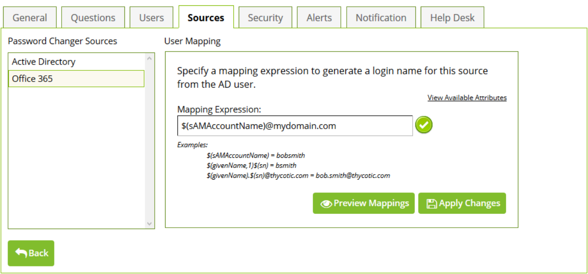

[title]: # (Sources)
[tags]: # (sources)
[priority]: # (3)
# Sources

## Active Directory

The Active Directory password source represents the user’s domain. By default all security policies have
an Active Directory password source assigned. You can remove this source if you want only Office 365
sources (no Active Directory password resets).

## Office 365

Once an Office 365 password source has been created, then you may use it on a security policy. To do
so, open the security policy and then select the __Source tab__. The following screen is displayed:

Click __Add__ to add a new password source to the security policy. Select the source you want to add to this
security policy, then click __OK__. Then under __Password Changer Sources__ click on the source you want to
map and __User Mapping__ for that source will be displayed.

   

The mapping expression maps Active Directory Attributes to credentials used to create the login name
for the Office 365 user. Mapping expressions can be any combination of Active Directory Attributes and
actual text. Also Active Directory Attributes can be set to a specific length with the addition of a ‘,’
(comma) and the number of characters to include.

>**Note:** For Office 365, the default mapping expression is the user’s email address $(mail).

__View Available Attribute__

This will show a list of available Active Directory Attributes that are defined (see __Active Directory
Attributes__). You may select any attribute with a double click to place it in the mapping expression.

__Preview Mappings__

This will preview a list of up to 25 users, with the mapping expression evaluated.

__Apply Changes__ 

This will save the changes to the mapping expression associated the password source.

