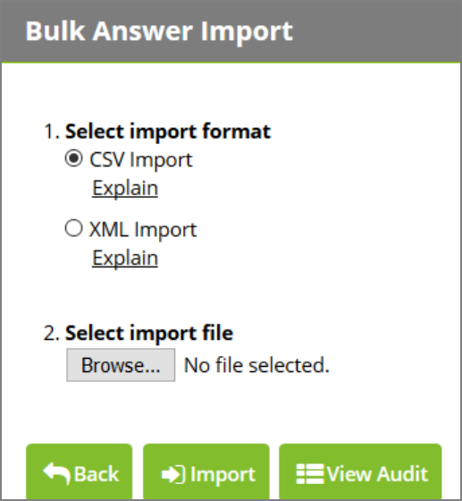

[title]: # (Setting Up Questions)
[tags]: # (questions)
[priority]: # (3)
# Setting Up Questions

## Creating a new Question

To create a new question, click the __Administration__ link in the top navigation bar and click __Security Questions__, then select the question type you’d like to create from the drop down list.

## Modifying an Existing Question

To modify an existing question, click the __Administration__ link in the top navigation bar and click __Security
Questions__, then click the name of the question that you would like to edit.

## Configuring a Question

After creating a new question or modifying an existing one, you can configure it with additional options.
Depending on the question type, there may be additional configuration options.

The following settings are present in all questions:

## Email Question, Phone Question, SMS Question

__Question Name__

This is the name of the question that will be displayed during the enrollment process and allow you to
refer back to it.

__Question Text__

The question text field which is optional information for the administrator.

__Enrollment Instructions__

Additional instructions to be displayed to the user during the enrollment process.

__Answer Instructions__

Additional instructions to be displayed to the user during the password reset process.
Text and Image questions contain additional configuration options:

## Text Question

__Minimum Length__

This is minimum length of an answer that the user supplies during the enrollment process.

## Image Question

__Image Set__

The set of images that are used during the enrollment process and password reset process. Each set
contains sixteen images.

__Order Matters__

During the password reset process, Order Matters specifies if they user must pick their images in a
specified order or not. Picking the images in the wrong order means the user did not answer the question
correctly.

__Position Randomly__

During the password reset process, Position Randomly specifies if the images in the image set are
displayed in a different, random order each time. After completing a question, click the __Save__ button to save the question and return to the questions
overview, or click __Save and Add New__ to save the question and add another of the same type.

__Deleting Questions__

You can delete a question as long as there are no security policies that use that question. You can delete
a question by navigating to __Administration > Security Questions__, clicking the name of a question, and clicking __Delete__.

An error will occur if the question is in use by a security policy. The error will indicate which policies are
using the question.

__Importing Question Answers__

Answers to questions can be loaded for users through the __Administration > Import Answers__ page.
Answers can be imported in CSV or XML format. Imported answers will not overwrite answers that users
have entered already. Import information is logged and can be accessed from the __Import Answers__ page by clicking __View Audit__.

   